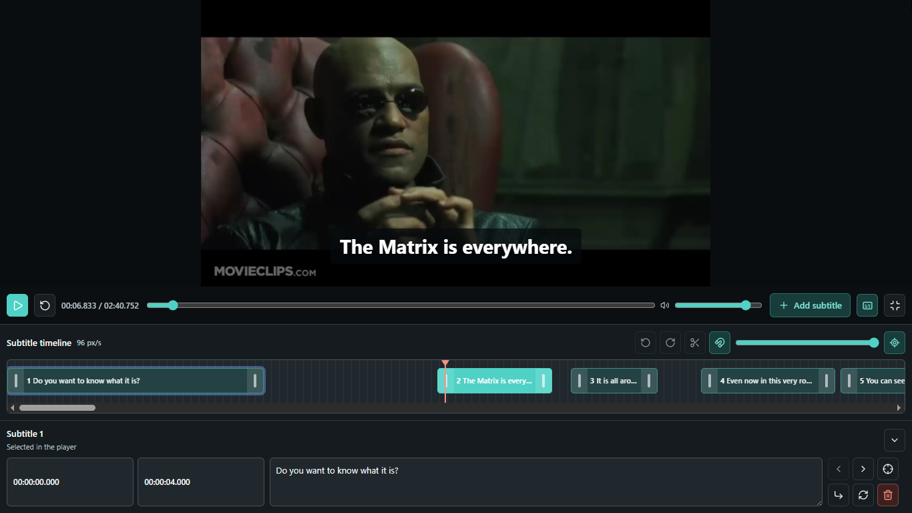

# Auto Subtitle

**A local-first browser workspace for generating, reviewing, and exporting subtitles from video.**

Auto Subtitle is for creators, editors, and developers who want a private subtitle workflow without a cloud transcription account. It runs FFmpeg.wasm and Transformers.js Whisper models in the browser, turns local videos into editable subtitle cues, and keeps timing review, cleanup, range regeneration, diagnostics, and export in one interface.

[User Guide](./docs/USER_GUIDE.md) | [Project State](./docs/project-state.md) | [Benchmark Guide](./benchmarks/README.md) | [Audit](./docs/transcription-accuracy-performance-audit.md) | [License](./LICENSE)



## Highlights

- Generate local Whisper subtitle drafts from MP4, WebM, MOV, or MKV videos.
- Review and edit subtitles against the source video with a player, caption overlay, magnetic timeline, and row editor.
- Import SRT, WebVTT, or Auto Subtitle project JSON files.
- Export SRT, WebVTT, TXT transcripts, or `.auto-subtitle.json` project files.
- Regenerate selected subtitle ranges up to 29 seconds with multiple local alternatives.
- Autosave subtitles, settings, formatting, and video metadata in browser IndexedDB.
- Export bounded debug logs for local troubleshooting without storing audio or video bytes.
- Score captured local runs with a deterministic benchmark harness and gitignored fixture data.

## How It Works

1. Select or drop a local video file.
2. Choose the spoken language, output task, Whisper model, browser engine, and precision.
3. The worker extracts mono 16 kHz audio with FFmpeg.wasm and runs Whisper through Transformers.js.
4. Review, split, merge, retime, format, or regenerate cues in the editor.
5. Export subtitles, a transcript, a project JSON file, or a debug report.

## Tech Stack

- **Frontend:** React 19
- **Language:** TypeScript
- **Media and speech:** FFmpeg.wasm, Transformers.js, Whisper ONNX models
- **Data / Backend:** No application backend; IndexedDB autosave and localStorage preferences/diagnostics
- **Tooling:** Vite 8, Vitest, oxlint, npm, local benchmark scripts
- **Deployment:** Local Vite app; no hosted deployment configuration is committed

## Getting Started

### Requirements

- 64-bit Windows, macOS, or Linux with a current desktop browser
- Node.js `20.19+` or `22.12+` with npm, matching Vite 8's engine requirement
- Browser support for WebAssembly, Web Workers, and IndexedDB
- Network access for dependency installation and the first download of each selected Whisper model
- Enough memory for browser media processing; 8 GB RAM is a practical minimum, and 16 GB or more is recommended for typical use

Chrome or Edge are recommended, especially for WebGPU. Firefox and Safari may work, but codec, WebGPU, WebAssembly, and media-decoding support vary by browser and device.

### Install and Run

```bash
git clone https://github.com/zxyandreay/auto-subtitle.git
cd auto-subtitle
npm ci
npm run dev
```

Open `http://127.0.0.1:5173` if the browser does not open automatically.

### Windows Quick Launch

Double-click `local-launch.bat`. The launcher installs dependencies when needed, starts the local app at `http://127.0.0.1:5173`, and opens it in your default browser. Keep the terminal open while using the app, then press Enter there to stop the server.

## Usage

1. Choose or drop an MP4, WebM, MOV, or MKV video.
2. In **Local transcription**, choose the language, output, model, engine, and precision.
3. Select **Transcribe locally** and keep the page open while audio extraction and transcription run.
4. Review the generated draft in the video preview, timeline, and subtitle editor.
5. Export SRT, WebVTT, TXT, or project JSON from the toolbar.

Generated subtitles are a draft. Review names, punctuation, wording, and timing before publishing. See the [User Guide](./docs/USER_GUIDE.md) for model notes, regeneration steps, keyboard shortcuts, import/export details, and troubleshooting.

## Available Scripts

| Command | Purpose |
| --- | --- |
| `npm run dev` | Start the development server on `127.0.0.1:5173` |
| `npm run typecheck` | Run TypeScript project checks |
| `npm run lint` | Run oxlint |
| `npm test` | Run the Vitest test suite |
| `npm run build` | Typecheck and create a production build |
| `npm run preview` | Preview the production build on `127.0.0.1:4173` |
| `npm run benchmark:self-test` | Validate benchmark scorer behavior with synthetic data |
| `npm run benchmark` | Score a captured local run from a manifest and run descriptor |
| `npm run benchmark:compare` | Compare two benchmark reports without labeling a winner |

## Data, Privacy, and Security

- **Data storage:** Autosave stores project data in IndexedDB under `auto-subtitle`; theme and diagnostic history use localStorage.
- **Network use:** npm downloads dependencies during setup. Transformers.js can download selected model files from the model host on first use and then use the browser cache when available.
- **Media handling:** The selected video is kept as a browser `File` plus a temporary object URL. The original video is not copied into the repository, `public/`, IndexedDB, or project JSON exports.
- **Processing:** FFmpeg.wasm and Transformers.js run in the browser. Extracted audio is held in browser/worker memory during processing.
- **Authentication:** There is no account system, backend database service, analytics, tracking, Supabase, Firebase, paid transcription API, or external AI API integration.
- **Diagnostics:** Debug logs may include file metadata, settings, recognized text, timing decisions, worker-stage measurements, errors, and generated subtitle entries. They do not include audio or video bytes.

When the app is started through `local-launch.bat`, progress and generated caption text are also posted to the local Vite dev server so the launcher terminal can show live progress. That endpoint is served on `127.0.0.1`.

## Project Structure

```text
auto-subtitle/
|-- benchmarks/           Local benchmark harness docs, manifests, fixtures, and results
|-- docs/                 Extended documentation, audit notes, and images
|-- public/               Favicon and static browser assets
|-- scripts/              Local launcher and benchmark scripts
|-- src/
|   |-- components/       React UI panels and controls
|   |-- diagnostics/      Browser-local debug log support
|   |-- media/            Video validation
|   |-- project/          IndexedDB autosave
|   |-- subtitles/        Import, export, validation, editing, formatting
|   |-- tests/            Vitest tests
|   |-- transcription/    Model registry, settings, timing, repair, provider bridge
|   `-- workers/          FFmpeg.wasm and Transformers.js worker
|-- package.json          Scripts and dependencies
|-- vite.config.ts        Vite, Vitest, and local terminal progress config
`-- README.md
```

## Documentation

- [User Guide](./docs/USER_GUIDE.md) covers day-to-day use, model choices, regeneration, shortcuts, and troubleshooting.
- [Project State](./docs/project-state.md) documents architecture, state flow, transcription internals, storage, and test coverage.
- [Transcription Accuracy and Performance Audit](./docs/transcription-accuracy-performance-audit.md) records the July 2026 audit scope, confirmed changes, and remaining real-media validation needs.
- [Benchmark Guide](./benchmarks/README.md) explains how to score local captured runs with gitignored fixtures and references.

## Status and Limitations

**Status:** Active local-first browser application.

- The repository is an app, not a published npm library; `package.json` is marked private.
- There is no committed hosted deployment or production backend.
- Browser transcription can require significant memory and time, especially for long videos or high-resource models.
- FFmpeg.wasm writes the selected file into an in-memory filesystem before extraction; this is not true streaming video processing.
- The complete decoded audio buffer is held in browser memory during transcription.
- New projects default to the Base model, explicit English, automatic supported-engine selection, and `q8` model weights. Legacy `auto` language settings resolve to English in the current Transformers.js integration, so choose the spoken language explicitly for non-English media.
- Word-level timestamps depend on model support and may fall back to segment timestamps.
- Generated timing is improved by speech-aware windowing, coverage repair, and deterministic formatting, but it is not guaranteed perfect.
- Automated tests and benchmark self-tests do not run a full real-browser FFmpeg plus Whisper model job.
- The benchmark harness does not include media, references, model files, or measured accuracy/performance results.
- Project JSON files do not embed the original video, so restoring a project requires selecting the video again.

## Contributing

Issues and focused pull requests are welcome. For larger changes, open an issue first and keep generated media, model caches, build output, logs, local environment files, and secrets out of git.

## License

Project source code is MIT licensed. See [LICENSE](./LICENSE) for the complete terms.

Important dependency notes:

- `@huggingface/transformers` is Apache-2.0.
- `@ffmpeg/ffmpeg` is MIT.
- `@ffmpeg/core` is GPL-2.0-or-later. Review FFmpeg and dependency licensing obligations before redistributing builds that bundle FFmpeg core files.
- Whisper model repositories have their own model cards and terms on Hugging Face.

This section is informational and not legal advice.

## Author

Built by [zxyandreay](https://github.com/zxyandreay).
