# Auto Subtitle Project State

This document describes the current implementation of Auto Subtitle: what the app is, how it is structured, how users move through it, how videos become editable subtitle entries, how local model execution is wired, and where state is stored.

Auto Subtitle is a local-first React web application for generating, editing, importing, previewing, and exporting subtitles for videos selected from the user's computer. The app is intentionally browser-centered: there is no application backend, no user account system, no database service, no cloud transcription API, no analytics, and no upload path for user media.

## Current Snapshot

| Area | Current state |
| --- | --- |
| Product name | Auto Subtitle |
| Repository | `zxyandreay/auto-subtitle` |
| Package name | `auto-subtitle` |
| Runtime | Browser app served by Vite |
| Frontend | React 19, TypeScript, CSS |
| Local media processing | FFmpeg.wasm |
| Local speech recognition | Transformers.js automatic speech recognition pipeline with Whisper ONNX models |
| Persistence | Browser IndexedDB autosave and localStorage theme preference |
| Import formats | SRT, WebVTT, Auto Subtitle project JSON |
| Export formats | SRT, WebVTT, TXT transcript, Auto Subtitle project JSON |
| Launcher | `local-launch.bat` plus `scripts/local-launch.ps1` |
| Dev terminal telemetry | Vite middleware endpoint at `/__auto_subtitle_terminal` |
| Tests | Vitest tests for timestamp, subtitle, import, export, project, and editing utilities |

## Product Goals

Auto Subtitle is built around these implementation principles:

1. Keep the user's media local to the browser whenever possible.
2. Make transcription failures visible instead of fabricating subtitle output.
3. Keep manual editing, import, export, and autosave useful even when transcription cannot run.
4. Treat generated subtitles as a draft that the user reviews before export.
5. Keep the transcription boundary small so another local engine can be added later without rewriting the editor.
6. Use deterministic subtitle data structures after import or transcription so all editor, preview, validation, autosave, and export paths share the same source of truth.

## High-Level Architecture

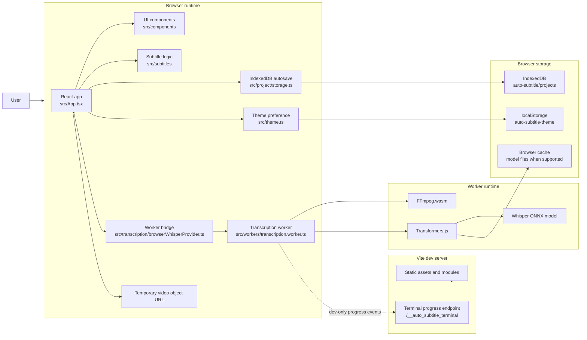

The core design is a single-page app with a worker-backed transcription provider. All generated or imported subtitles become `SubtitleEntry[]`. Once subtitle entries exist, the app does not care whether they came from Whisper, SRT, WebVTT, project JSON, or manual entry.

## Runtime Boundaries

| Boundary | Files | Responsibility |
| --- | --- | --- |
| Browser app | `src/main.tsx`, `src/App.tsx`, `src/components/*` | Renders the workspace, owns top-level state, connects user actions to subtitle operations. |
| Subtitle domain logic | `src/subtitles/*`, `src/types/subtitles.ts`, `src/utils/time.ts` | Parses, formats, validates, imports, exports, splits, merges, shifts, normalizes, and renumbers subtitles. |
| Transcription provider | `src/transcription/browserWhisperProvider.ts`, `src/transcription/types.ts`, `src/transcription/models.ts`, `src/transcription/capabilities.ts` | Registers model metadata and compatibility, normalizes settings, starts and cancels full transcription or range-regeneration workers, routes their discriminated results, and detects browser capability warnings. |
| Audio extraction arguments | `src/transcription/audioExtraction.ts` | Builds full or time-bounded FFmpeg commands that preserve delayed audio-track timing while producing mono 16 kHz PCM WAV output. |
| Range regeneration | `src/transcription/regeneration.ts`, `src/subtitles/regeneration.ts` | Validates ranges, budgets recognition context, defines decoding profiles, deduplicates alternatives, constrains timing, and atomically replaces overlapping cues. |
| Speech activity and windowing | `src/transcription/speechActivity.ts`, `src/transcription/windowing.ts` | Detects padded speech regions locally and plans silence-preferred ownership windows within a 29-second model budget. |
| Coverage and timing recovery | `src/transcription/coverage.ts`, `src/transcription/repair.ts`, `src/transcription/reconciliation.ts`, `src/transcription/timingRefinement.ts` | Finds likely missed speech, plans one bounded repair pass, reconciles overlap words, and snaps generated cues to safe speech boundaries. |
| Local diagnostics | `src/diagnostics/*`, worker diagnostic events, provider bridge, toolbar export | Persists bounded structured evidence for model output, timing decisions, recovery, formatting, environment, and errors without storing media bytes. |
| Timestamp normalization | `src/transcription/timestampNormalization.ts` | Validates ASR chunks, maps window-relative timestamps onto the video timeline, assigns boundary chunks to one core, and prevents overlap-only fallback captions. |
| Worker implementation | `src/workers/transcription.worker.ts` | Runs FFmpeg.wasm, decodes full or bounded audio, loads the ASR model, transcribes windows or sequential regeneration profiles, and posts typed results. |
| Live preview merging | `src/subtitles/livePreview.ts` | Merges streamed generated subtitles into the editor while preserving user edits and deletions during an active transcription. |
| Project storage | `src/project/storage.ts` | Stores and restores project autosave records in IndexedDB. |
| Vite dev server | `vite.config.ts` | Serves the app, applies cross-origin isolation headers, excludes heavy WASM dependencies from optimization, exposes terminal progress middleware in dev. |
| Windows launcher | `local-launch.bat`, `scripts/local-launch.ps1` | Installs dependencies if needed, starts Vite, opens the browser, and stops the Vite process tree when the user presses Enter or closes the launcher session. |

## Repository Map

```text
.
|-- docs/
|   `-- project-state.md
|-- local-launch.bat
|-- scripts/
|   `-- local-launch.ps1
|-- src/
|   |-- App.tsx
|   |-- main.tsx
|   |-- components/
|   |-- hooks/
|   |-- media/
|   |-- project/
|   |-- subtitles/
|   |-- tests/
|   |-- transcription/
|   |-- types/
|   |-- utils/
|   `-- workers/
|-- public/
|-- vite.config.ts
|-- package.json
|-- package-lock.json
|-- tsconfig*.json
`-- README.md
```

## Application Entry And Top-Level State

`src/main.tsx` mounts `App` into `#root` under React `StrictMode`.

`src/App.tsx` owns the main runtime state:

| State | Purpose |
| --- | --- |
| `theme` | Current theme preference: `light`, `dark`, or `system`. |
| `video` | Selected browser `File`, temporary object URL, and discovered duration. |
| `videoWarnings` / `videoErrors` | Validation feedback for file type, file size, file emptiness, and unreadable metadata. |
| `currentTime` | Current playback position in seconds. |
| `subtitlesVisible` | Whether the overlay is visible in the video player. |
| `settings` | Transcription and formatting settings. |
| `progress` | Current transcription stage, message, determinate progress, and optional technical details. |
| `busy` | Whether a transcription job is active. |
| `notice` | Dismissible success, warning, or error banner. |
| `autosave` | Loaded autosave metadata and project contents. |
| `autoScroll` | Whether the editor scrolls the active subtitle into view. |
| `showOnlyErrors` | Whether the editor filters rows to entries with validation issues. |
| `selectedSubtitleId` | Shared selection for the player timeline, player editor, and main subtitle editor. |
| `focusSubtitleRequest` | Monotonic request used to focus newly added or duplicated text in the player editor. |
| `shiftMilliseconds` | Global timing shift amount. |
| `includeTranscriptTimestamps` | Whether TXT export includes timestamps. |
| `seekRequest` | Imperative seek request sent to the video player. |
| `playRangeRequest` | Imperative range-play request sent to the video player. |
| `playToggleRequest` | Imperative keyboard play/pause toggle sent to the video player. |
| `videoElementRef` | Direct reference used to capture the media element's exact playhead and pause it for manual subtitle insertion. |
| `jobRef` | Current `TranscriptionJob` for cancellation. |
| `useUndoableSubtitles()` | Subtitle history state: `past`, `present`, and `future`. |

The top-level app wires browser events and side effects:

1. Applies and saves theme changes.
2. Loads IndexedDB autosave on mount.
3. Debounces autosave writes by 700 milliseconds after subtitle, settings, or video metadata changes.
4. Revokes temporary video object URLs when replacing or unmounting a video.
5. Cancels active transcription jobs when the app unmounts.
6. Registers keyboard shortcuts for playback, seeking, undo, and redo.

## User Interface Composition

```mermaid
flowchart TB
    App["App"]
    Toolbar["ProjectToolbar"]
    DropZone["FileDropZone"]
    VideoPlayer["VideoPlayer"]
    TranscriptionPanel["TranscriptionPanel"]
    FormattingPanel["FormattingPanel"]
    GlobalTools["GlobalTools"]
    SubtitleEditor["SubtitleEditor"]
    Notice["NoticeBanner"]

    App --> Toolbar
    App --> Notice
    App --> DropZone
    App --> VideoPlayer
    App --> TranscriptionPanel
    App --> FormattingPanel
    App --> GlobalTools
    App --> SubtitleEditor

    Toolbar --> Import["Import SRT, VTT, JSON"]
    Toolbar --> Export["Export SRT, VTT, TXT, JSON"]
    DropZone --> VideoFile["Selected video File"]
    VideoPlayer --> Overlay["Active subtitle overlay"]
    VideoPlayer --> Timeline["Interactive subtitle timeline"]
    VideoPlayer --> PlayerEditor["Selected subtitle editor"]
    TranscriptionPanel --> WorkerJob["Transcription job"]
    FormattingPanel --> Preferences["Formatting preferences"]
    GlobalTools --> BatchOps["Shift, normalize, clean, jump, undo, redo"]
    SubtitleEditor --> RowOps["Add, edit, split, merge, duplicate, move, delete"]
    SubtitleEditor --> Regenerate["Regenerate editable subtitle range"]
```

### Component Responsibilities

| Component | File | Main responsibility |
| --- | --- | --- |
| `ProjectToolbar` | `src/components/ProjectToolbar.tsx` | Caption-symbol branding plus project-level import, restore, export, clearing, and theme actions. |
| `FileDropZone` | `src/components/FileDropZone.tsx` | Drag/drop and file picker for video files, file facts, validation messages, and removal. |
| `VideoPlayer` | `src/components/VideoPlayer.tsx` | Controlled media/fullscreen workspace containing video, overlay, playback controls, timeline, and player subtitle editor. |
| `SubtitleTimeline` | `src/components/SubtitleTimeline.tsx` | Zoomable/scrollable cue track, playhead follow, selection, validation styling, pointer-captured timing edits, and keyboard nudging. |
| `PlayerSubtitleEditor` | `src/components/PlayerSubtitleEditor.tsx` | Selected-cue text/timestamp editing, navigation, seek, range playback, duplicate, and delete actions. |
| `TranscriptionPanel` | `src/components/TranscriptionPanel.tsx` | Language/model/engine/precision/chunk settings, model metadata, compatibility and capability warnings, determinate progress display, start/cancel buttons. |
| `FormattingPanel` | `src/components/FormattingPanel.tsx` | Formatting preferences and reapply formatting action. |
| `SubtitleEditor` | `src/components/SubtitleEditor.tsx` | Playhead insertion, editable subtitle rows, timestamp parsing, row actions, search, active-row auto-scroll, and validation issue display. |
| `RegenerationDialog` | `src/components/RegenerationDialog.tsx` | Editable range validation, local progress, original/alternative comparison, temporary preview, cancellation, and applying a selected result. |
| `IconButton` | `src/components/IconButton.tsx` | Shared accessible icon button with `aria-label` and `title`. |
| `SubtitleLogo` | `src/components/SubtitleLogo.tsx` | Reusable letter-free SVG caption-bubble symbol displayed in the app header. |

### Branding Assets

Auto Subtitle uses a caption-bubble symbol with two subtitle lines instead of initials or letter-based branding. `SubtitleLogo` renders the scalable inline header mark using `currentColor`, so it follows the active theme. `public/favicon.svg` carries the same symbol on a solid accent background for the browser tab and other favicon surfaces. `index.html` declares that SVG as the any-size favicon.

## Primary User Flow: Video To Subtitles


The selected video remains a browser `File`. The app creates a temporary object URL for playback and revokes it when the video is replaced, removed, or the app unmounts.

## Import, Edit, Preview, Export Flow

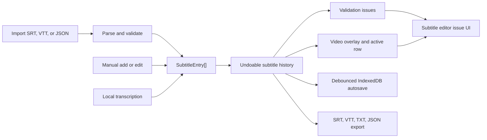

Once entries exist, all paths converge:

1. `useUndoableSubtitles` stores the current list and up to 80 past states for undo.
2. `validateSubtitles` marks malformed times, negative times, invalid ranges, duration overflow, empty text, and overlaps.
3. The video player finds the active subtitle by comparing `currentTime` to entry `startTime` and `endTime`.
4. Autosave serializes project JSON into IndexedDB.
5. Exporters filter out entries with validation errors and empty text before producing SRT, VTT, or TXT.

## Transcription Pipeline Overview

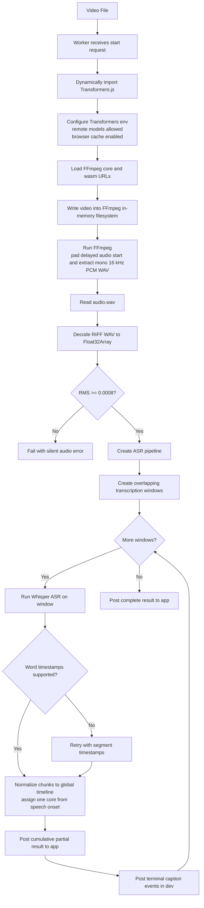

## Worker Message Flow

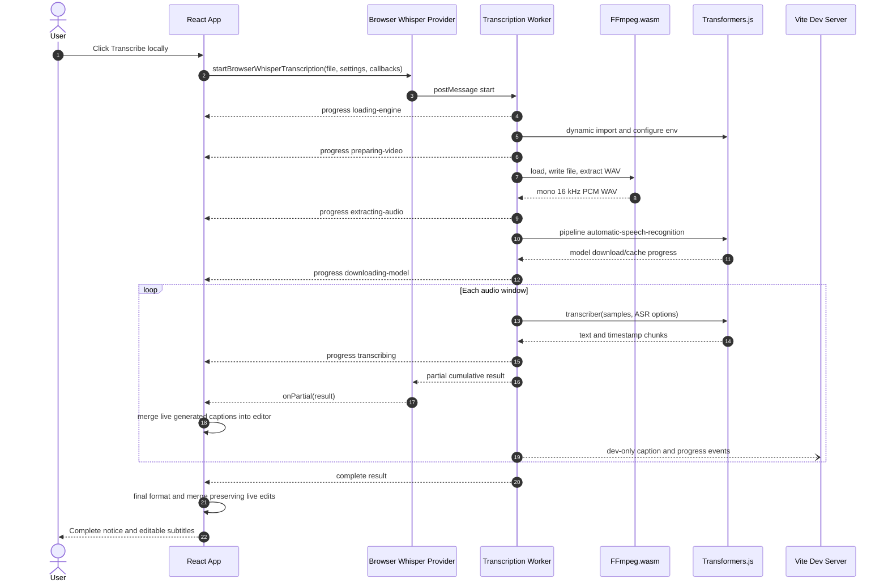

Cancellation is user-driven from the `Cancel` button or app teardown:

1. `TranscriptionJob.cancel()` posts a `cancel` request to the worker.
2. The provider terminates the worker immediately.
3. The promise rejects with `Transcription cancelled by the user.`
4. The app marks the progress stage as `cancelled`, keeps the current progress value, clears busy state, and leaves the editor ready for manual work or imports.

The worker also checks `assertNotCancelled()` between major steps so cooperative cancellation can stop long flows when the worker has not already been terminated.

Live partial previews use the same local worker path. After each completed audio window, the worker posts a non-terminal `partial` event with the cumulative raw segments. The provider forwards that event through `onPartial`, and the app formats those generated segments into preview subtitles. The editor receives the preview subtitles immediately, so the user can seek, preview, and edit captions before the final transcription result arrives.

The live preview merge keeps user changes stable while the worker continues:

1. Existing subtitles from before transcription are treated as the base that the generated result will replace.
2. Streamed generated rows are tracked by id.
3. If the user edits a streamed row, later partial updates preserve that edited row.
4. If the user deletes a streamed row, later partial updates do not re-add that same generated row.
5. User-added rows created during transcription are kept alongside streamed generated rows.
6. Final completion applies the full generated-caption optimization again and merges it with any preserved live edits before settling the editor state.

## Detailed Video Processing

### 1. Video Selection

`FileDropZone` accepts file picker input and drag/drop input. The accepted extensions and MIME types are defined in `src/media/video.ts`:

| Accepted extension | Accepted MIME type |
| --- | --- |
| `.mp4` | `video/mp4` |
| `.webm` | `video/webm` |
| `.mov` | `video/quicktime` |
| `.mkv` | `video/x-matroska` |

Validation checks:

1. Rejects files that have neither an accepted extension nor an accepted MIME type.
2. Rejects empty files.
3. Warns when file size is greater than 500 MB.
4. Warns when browser-discovered duration is greater than 30 minutes.
5. Reports a metadata error if the browser cannot read a finite duration.

When validation succeeds:

1. Any previous object URL is revoked.
2. A new `URL.createObjectURL(file)` is created.
3. `video` state becomes `{ file, objectUrl, duration: 0 }`.
4. The preview video loads metadata and reports duration back to the app.

### 2. Transcription Job Creation

When the user starts transcription, `App`:

1. Clears the current notice.
2. Sets `busy` to `true`.
3. Sets progress to `loading-engine` with progress `0.01`.
4. Calls `startBrowserWhisperTranscription(video.file, settings, { onProgress: setProgress })`.
5. Stores the returned job in `jobRef` for cancellation.

The provider creates a module worker:

```ts
new Worker(new URL('../workers/transcription.worker.ts', import.meta.url), {
  type: 'module',
})
```

The provider listens for typed worker outcomes:

| Worker event | Provider behavior |
| --- | --- |
| `progress` | Calls `callbacks.onProgress(data.progress)`. |
| `partial` | Full transcription only: forwards cumulative generated segments through `onPartial`. |
| `complete` | Terminates the worker and resolves the job promise. |
| `regeneration-complete` | Terminates the worker and resolves the range-regeneration promise. |
| `error` | Terminates the worker and rejects the job promise. |

### 3. Worker Initialization

The worker receives `{ type: 'start', file, settings }`, resets cancellation state, creates a job id, resets monotonic progress, and starts `transcribe(file, settings)`.

The worker dynamically imports Transformers.js:

```ts
const { env, pipeline } = await import('@huggingface/transformers')
```

Then it configures the Transformers.js environment:

| Setting | Value | Meaning |
| --- | --- | --- |
| `env.allowLocalModels` | `false` | The browser build does not expect bundled local model files. |
| `env.allowRemoteModels` | `true` | Model files can be downloaded from the configured model host. |
| `env.useBrowserCache` | `true` | Browser cache is used when supported so later runs can avoid redownloading unchanged model files. |

### 4. Audio Extraction With FFmpeg.wasm

`extractAudio(file)` performs local audio conversion in the worker:

1. Creates a new `FFmpeg` instance.
2. Subscribes to FFmpeg progress events and maps them to app progress.
3. Loads the FFmpeg core and WASM URLs imported through Vite:
   - `@ffmpeg/core?url`
   - `@ffmpeg/core/wasm?url`
4. Writes the selected browser file into FFmpeg's in-memory filesystem with `fetchFile(file)`.
5. Executes FFmpeg with these arguments:

```text
-i input-<timestamp>
-vn
-af aresample=async=1:first_pts=0
-ac 1
-ar 16000
-acodec pcm_s16le
-f wav
audio.wav
```

The output is mono, 16 kHz, signed 16-bit PCM WAV. Before encoding it, `aresample=async=1:first_pts=0` reconciles samples with the input audio timestamps and pads the beginning with silence when the audio stream starts after media time zero. This matters because WAV carries sample order rather than the source container's delayed stream start; without padding, speech beginning halfway through a video can become WAV time zero and shift every generated subtitle early.

This behavior follows the official [FFmpeg audio resampler documentation](https://www.ffmpeg.org/ffmpeg-resampler.html), where `async` enables timestamp compensation and `first_pts=0` is specifically documented as padding the beginning with silence when audio starts after video. The bundled FFmpeg.wasm core includes the `aresample` filter.

The worker then:

1. Reads `audio.wav` from FFmpeg's filesystem.
2. Deletes input and output files on a best-effort basis.
3. Terminates FFmpeg.
4. Decodes the WAV bytes manually.

### 5. WAV Decoding

`decodePcmWav(bytes)` parses the WAV container:

1. Reads `RIFF` at byte 0 and `WAVE` at byte 8.
2. Iterates chunks from byte 12.
3. Reads the `fmt ` chunk to discover channels, sample rate, and bits per sample.
4. Finds the `data` chunk.
5. Requires mono, 16-bit PCM data.
6. Converts each signed 16-bit little-endian sample into a float in the range approximately `-1` to `1` by dividing by `32768`.

The resulting object is:

```ts
{
  samples: Float32Array
  sampleRate: number
}
```

The worker computes a sampled RMS value with `calculateRms`. If RMS is below `0.0008`, the worker fails with `The extracted audio appears to be empty or silent.`

### 6. Whisper Model Loading

`src/transcription/models.ts` is the single registry for model IDs, labels, family, tier, language coverage, supported tasks, full-transcription/regeneration support, recommended engine and dtype, resource level, and warning copy.

| UI label | Model id | Languages | Translation | Resource level |
| --- | --- | --- | --- | --- |
| Fast model - Tiny | `onnx-community/whisper-tiny` | Multilingual | Yes | Low |
| Balanced model - Base | `onnx-community/whisper-base` | Multilingual | Yes | Medium |
| High accuracy model - Large v3 Turbo | `onnx-community/whisper-large-v3-turbo` | Multilingual | No | High |
| English high quality model - Distil Large v3 | `distil-whisper/distil-large-v3` | English only | No | High |

Compatibility is enforced at three boundaries:

1. The selector keeps incompatible models visible but disabled with explanatory metadata.
2. `App` resolves changes to model, language, or task before saving settings and shows one non-blocking switch notice.
3. The worker resolves again before pipeline loading, ASR options, partial results, final results, or regeneration results, protecting old projects and direct worker callers.

Distil Large v3 requires an explicitly English language and `transcribe`; its runtime call is forced to `language: 'english'` and `task: 'transcribe'`. Large v3 Turbo also requires `transcribe`. Translation falls back to Base. A non-English Distil selection falls back to Large v3 Turbo for `auto`/`webgpu` execution or Base for `wasm`/`cpu`. Unknown IDs fall back to Base, while Tiny and Base remain compatible with existing settings.

The worker creates a Transformers.js pipeline:

```ts
pipeline('automatic-speech-recognition', settings.modelId, {
  device: settings.executionProvider,
  dtype: settings.dtype === 'auto' ? undefined : settings.dtype,
  progress_callback: ...
})
```

Current `executionProvider` choices:

| Setting | Meaning |
| --- | --- |
| `auto` | Let Transformers.js choose an available execution path. |
| `webgpu` | Prefer WebGPU where available. |
| `wasm` | Prefer WebAssembly. |
| `cpu` | Use CPU execution path. |

Current `dtype` choices in the UI and type model are `auto`, `q8`, and `fp32`. The accurate-local profile defaults to `q8`; `auto` remains accepted for legacy/imported settings. When dtype is not `auto`, the worker passes it through to the pipeline. High-resource models recommend WebGPU and `q8`; missing WebGPU, CPU/WASM selection, and `fp32` each produce a specific warning but do not block the job.

Model download/cache progress is translated from Transformers.js progress callback payloads. The user-facing stage is `Loading speech model`, because files may come from either browser cache or the model repository. Technical details identify the selected label, resolved ID, resource class, engine, and dtype. The worker supports payloads with either:

1. A numeric `progress` percentage, or
2. Numeric `loaded` and `total` byte counts.

The user sees those as determinate progress updates when available.

## How Whisper Works In This App

Whisper is an encoder-decoder transformer model for speech recognition and speech translation. In Auto Subtitle, the user does not interact with the model directly. The worker passes normalized audio samples to a Transformers.js automatic speech recognition pipeline, and that pipeline handles the model-specific preprocessing and decoding.

Conceptually, the pipeline does the following:

1. Converts raw audio samples into the acoustic features expected by Whisper.
2. Runs the Whisper encoder to create latent speech representations.
3. Runs the Whisper decoder to generate tokens for the selected task.
4. Decodes tokens into text.
5. When timestamps are requested, returns timestamped chunks that the app can map to subtitle ranges.

The app configures the model through these user-facing settings:

| Setting | Worker option | Effect |
| --- | --- | --- |
| Spoken language | `language` | `auto` becomes `undefined`; a selected language is passed to the ASR call. |
| Output | `task` | `transcribe` keeps the source language; `translate` asks Whisper for English output. |
| Model | `modelId` | Chooses one of the four registered browser-compatible ASR repositories after compatibility resolution. |
| Engine | `device` | Chooses auto, WebGPU, WASM, or CPU execution provider. |
| Precision | pipeline `dtype` | Chooses auto, q8, or fp32 model weights. |
| Use word timestamps | `return_timestamps` | Uses `'word'` when enabled; otherwise uses segment timestamps. |

Accurate-local synchronization defaults:

| Setting | Default |
| --- | --- |
| Language / task / provider / dtype | `auto` / `transcribe` / `auto` / `q8` |
| Maximum input / speech target | `29.0 s` / `26.0 s` |
| Speech-aware / fixed fallback overlap | `1.5 s` / `4.0 s` |
| Hard minimum window | `5.0 s` |
| VAD frame / hop / minimum speech | `30 ms` / `10 ms` / `250 ms` |
| VAD merge gap / pre-pad / post-pad | `350 ms` / `200 ms` / `300 ms` |
| Repair context / maximum ranges | `750 ms` per side / `20` |

`normalizeTranscriptionSettings` and `normalizeFormattingPreferences` fill missing fields when schema-v1 projects or autosaves were created before these settings existed. Existing recognized values are retained, the project schema version remains unchanged, and model inputs are clamped to the 29-second safety ceiling.

The worker calls the transcriber with:

```ts
{
  return_timestamps: true | 'word',
  chunk_length_s: 0,
  stride_length_s: 0,
  language: settings.language === 'auto' ? undefined : settings.language,
  task: settings.task
}
```

`chunk_length_s` and `stride_length_s` are set to `0` because Auto Subtitle performs its own explicit audio windowing before calling the model. This gives the app direct control over progress, caption preview events, overlap, and timeline normalization. Every manually prepared input is capped at 29 seconds, leaving margin below Whisper's fixed feature-input limit.

For Distil Large v3, the resolver overrides the ASR call to explicit English transcription. Turbo and Distil translation requests never reach the pipeline with `task: 'translate'`; they resolve to Base first. Word-timestamp failure continues to retry the same resolved model with segment timestamps.

## Speech Activity, Windowing, And Timestamp Normalization

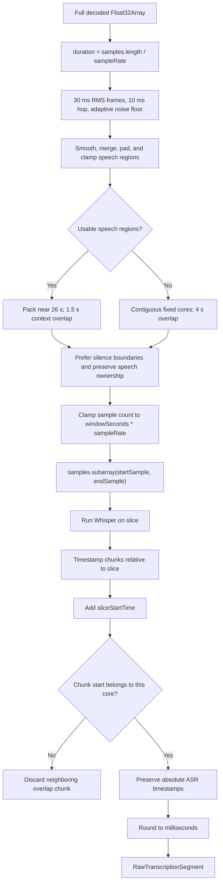

Speech and windowing details:

1. `detectSpeechRegions` analyzes mono 16 kHz samples with 30 ms RMS frames and a 10 ms hop. An adaptive noise estimate, a nonzero RMS floor, isolated-frame smoothing, a 250 ms minimum, a 350 ms merge gap, and 200/300 ms pre/post padding produce deterministic regions clamped to the audio duration.
2. Usable regions are packed into ownership spans near the 26-second target. Interior speech-aware windows use 1.5 seconds of context and never exceed the 29-second maximum.
3. Long continuous speech is split into contiguous ownership cores with overlap context, so every detected speech instant belongs to at least one core.
4. If VAD is disabled, fails, or yields no usable regions, the fixed planner covers the complete timeline with a default 4-second overlap and the same 29-second cap.
5. First and last windows are naturally shorter when context is unavailable at the media boundary; tiny windows are expanded in surrounding silence toward the 5-second hard minimum where possible.
6. Sample indices use `floor` for slice starts and `ceil` for requested ends, are capped to the exact model sample budget, and derive `sliceStartTime` from the first sample actually passed to Whisper.
7. ASR timestamps are converted to the full-video timeline by adding that exact sample-derived offset. Chunk starts assign ownership, while crossing chunks keep their full absolute end times.
8. Adjacent window results within two seconds of a core boundary use conservative normalized-token comparison. Near duplicates are kept once; suffix/prefix overlap is removed from the later text while unique words are retained.
9. Times are rounded to milliseconds.

This design prefers cuts in silence while keeping a fixed-window fallback for difficult audio. VAD affects planning and generated-cue refinement only; it does not modify imported/manual subtitles.

### Coverage Recovery And Speech-Boundary Refinement

After the first normalized ASR pass, subtitle intervals are merged and compared with detected speech. Coverage uses 100 ms tolerance, ignores gaps below 250 ms, and reports a region only when at least 500 ms and 40% of that speech region remain uncovered.

When repair is enabled, one pass processes at most 20 uncovered ranges. Each range receives 750 ms of context on both sides, remains below 29 seconds, and reuses the already loaded transcriber. Repair results must have valid text/timing, overlap the uncovered range, and differ from nearby existing cues. Accepted timing is clipped away from neighboring cues using the configured 80 ms gap. There is no recursive coverage loop.

If ASR returns non-empty text without usable chunks, normalization creates a `confidence: 0.35` fallback only when at least 500 ms of VAD evidence exists in the owned window or repair range. The cue is bounded to that evidence, receives the normal 80/180 ms lead/tail padding, and is capped at eight seconds. Text-only output over silence remains omitted.

Finally, generated raw segments may snap to a speech onset within 200 ms or an offset within 300 ms. The default 80 ms lead-in and 180 ms tail apply only when movement stays inside the search budget and adjacent proposed cues retain the configured gap. Imported and manually edited subtitles do not enter this worker refinement path.

## Timestamp Modes And Fallback

The worker supports two timestamp modes:

| Mode | Trigger | Result |
| --- | --- | --- |
| Word timestamps | Accurate-local default | Attempts word-level timing and grouping. |
| Segment timestamps | Automatic fallback | Used after a known word-timestamp capability failure. |

Some exported Whisper models do not expose cross-attention outputs needed for word-level timestamps. When word timestamps fail with known messages such as `Model outputs must contain cross attentions to extract timestamps`, `token-level timestamps not available`, or `output_attentions=True`, the worker retries the current window with segment timestamps and uses segment timestamps for later windows.

This avoids failing the entire transcription just because word-level timestamps are not supported by the selected model export.

## ASR Result Normalization

The worker receives an unknown result shape from the pipeline and normalizes defensively:

1. If the result is an array, it reads the first item.
2. If `text` is present and is a string, it trims and stores it.
3. If `chunks` is present and is an array, each chunk is inspected.
4. A valid chunk must have:
   - `timestamp` as an array
   - numeric start and end values
   - finite times
   - `end > start`
   - `text` as a string
5. Invalid chunks are dropped.
6. Valid chunks are offset onto the full-video timeline.
7. Boundary-crossing chunks are assigned to the core containing their absolute start time, and their original absolute in/out times are preserved.
8. If the model returned text without usable timestamp chunks, VAD evidence in the owned range can provide a bounded low-confidence interval; without speech evidence, no subtitle is created.
9. If valid chunks begin in an adjacent overlap, no fallback caption is created. This prevents neighboring speech from appearing early or being recreated late.

When many chunks look word-level, the worker combines them into a single segment with a `words` array. Later formatting can split those words into readable subtitle entries if word timestamps are enabled.

## Formatting Generated Subtitles

`formatTranscriptionSegments` converts worker `RawTranscriptionSegment[]` into editor `SubtitleEntry[]`.

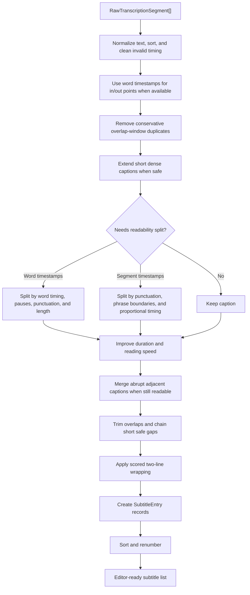

Formatting preferences:

| Preference | Default | Used for |
| --- | --- | --- |
| `maxCharsPerLine` | `42` | Splitting visible subtitle text into readable lines. |
| `maxCharsPerSubtitle` | `84` | Splitting long generated segments or grouping words. |
| `minDuration` | `1.1` | Enforcing readable minimum subtitle duration during overlap normalization. |
| `maxDuration` | `6` | Splitting overly long generated segments or word groups. |
| `gapBetweenSubtitles` | `0.08` | Preventing back-to-back overlap after normalization. |
| `useWordTimestamps` | `true` | Choosing word-level grouping when supported, with session fallback. |
| `subtitleLeadIn` / `subtitleTailPadding` | `0.08` / `0.18` | Padding generated word/speech boundaries. |
| `targetMaxCps` / `hardMaxCps` | `20` / `21` | Readable-duration target and hard timing guard. |
| `closeGapsBelow` | `0.50` | Safely chaining short generated-cue gaps. |

Best-practice inputs used for generated subtitles:

1. [Netflix Timed Text Style Guide: Subtitle Timing Guidelines](https://partnerhelp.netflixstudios.com/hc/en-us/articles/360051554394-Timed-Text-Style-Guide-Subtitle-Timing-Guidelines) uses a minimum subtitle duration of 5/6 second, allows longer maximum display time, recommends a small technical gap, and advises closing gaps below about half a second instead of leaving distracting flicker.
2. [BBC Subtitle Guidelines](https://bbc.github.io/subtitle-guidelines/) emphasize subtitle breaks that follow linguistic sense, complete clauses, and natural phrase units.
3. [DCMP Captioning Key](https://dcmp.org/learn/captioningkey) frames synchronization and readability as core caption quality requirements, meaning text should appear with the matching audio and remain readable long enough for viewers.

These sources are applied conservatively in Auto Subtitle. The app still honors the user-facing formatting preferences for generated captions, but the generated-only optimizer now treats the professional 5/6-second minimum as a floor when safe, extends very short captions before export, and reduces sub-half-second gaps by extending the previous caption rather than pulling the next caption too early.

Text formatting behavior:

1. Normalizes CRLF to LF.
2. Collapses repeated whitespace inside each line.
3. Removes empty lines.
4. Removes near-duplicate generated captions from overlapping audio windows when adjacent text and timing are highly similar.
5. Splits long generated captions first at sentence punctuation, then softer punctuation, then natural phrase boundaries.
6. Penalizes word-timed cuts that would create a very short phrase flash, even when punctuation exists.
7. Merges abrupt adjacent generated captions when the combined caption remains within line, duration, and reading-speed limits.
8. Wraps text with a scored two-line line-breaker that prefers balanced lines and avoids unsafe phrase breaks.
9. Limits final generated caption display to at most two visible lines.
10. Attempts to balance a short second line by moving a final word when useful.

Timing formatting behavior:

1. Times are rounded to milliseconds.
2. Times are clamped to zero and optionally to video duration.
3. When usable word timestamps exist, generated caption starts prefer the first word start with about 0.08 seconds of lead-in.
4. When usable word timestamps exist, generated caption ends prefer the last word end with about 0.18 seconds of tail padding.
5. Segment-level timing remains the fallback when word timestamps are absent or incomplete.
6. Generated captions target a maximum reading speed of about 21 characters per second.
7. Very short generated captions are extended toward the app minimum duration and the professional 5/6-second floor when safe.
8. Dense generated captions are extended when safe, then split if they still exceed readability limits.
9. Entries are sorted by start time and end time.
10. Indices are recalculated from 1.
11. Overlaps are resolved by trimming or shifting generated captions while preserving the configured technical gap.
12. Safe gaps below about 0.5 seconds are chained by extending the previous caption where possible, reducing visible flicker without starting the next word-timed caption early.

Generated-caption helper responsibilities:

| Helper | Purpose |
| --- | --- |
| `optimizeGeneratedCaptions` | Runs the generated-only post-processing pipeline before `SubtitleEntry` creation. |
| `calculateCharactersPerSecond` | Measures readable text density over caption duration. |
| `calculateReadableDuration` | Computes a deterministic readable duration target from text length and formatting preferences. |
| `needsSplitForReadability` | Decides whether a generated caption needs timing extension or segmentation. |
| `smoothAbruptGeneratedCaptions` | Merges short or too-fast adjacent generated captions when the result stays readable. |
| `normalizeForDuplicateComparison` | Canonicalizes generated text for conservative duplicate detection. |
| `tokenSimilarity` | Compares adjacent generated captions for overlap-window duplicate cleanup. |
| `dedupeOverlappingSegments` | Removes or safely merges adjacent duplicate generated segments near chunk boundaries. |

## Live Subtitle Preview While Transcribing

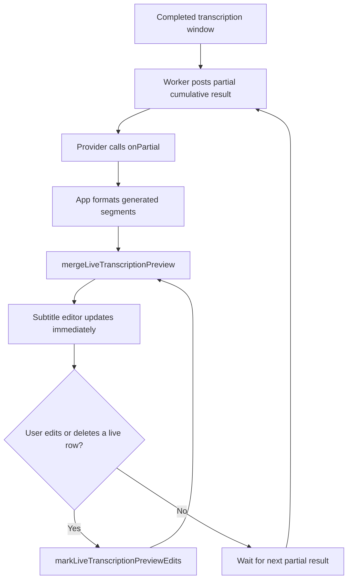

Live preview details:

1. Partial results are local worker messages; they do not add a backend or external transcription service.
2. The worker sends cumulative raw segments after each audio window finishes.
3. The app formats partial segments with the same generated-caption optimizer used for the final result.
4. `useUndoableSubtitles.preview` updates the current editor contents without adding automatic worker updates to the undo history.
5. `mergeLiveTranscriptionPreview` removes the pre-transcription base entries once generated captions arrive, matching final transcription replacement behavior.
6. User edits and deletions to streamed generated rows are tracked and preserved across later partial updates.
7. Rows the user adds manually during transcription are kept alongside streamed generated rows.

## Subtitle Range Regeneration

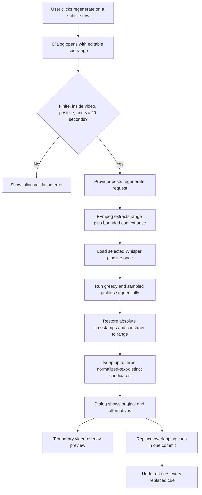

Regeneration details:

1. A row action is enabled only when a source video is selected and no local model job is active.
2. The dialog starts with the row's current timestamps and supports arbitrary adjusted ranges up to 29 seconds.
3. Context planning adds up to two seconds on each side only when the complete extracted model input remains within the 29-second safety budget.
4. `startBrowserWhisperRegeneration` starts a dedicated worker request; it never enters the full-transcription live-preview state.
5. The current compatible model, language, task, engine, dtype, word-timestamp preference, and formatting preferences are captured when generation begins. The worker enforces compatibility again and returns the resolved model ID.
6. The worker runs greedy decoding, then sampling at temperatures `0.4` and `0.75`; duplicate retries may use `0.9` and `1.0`. Processing stops after three distinct candidates or five total attempts.
7. Word timestamps use the existing segment-timestamp fallback when the model export lacks cross-attention output.
8. Empty, silent, duplicate-only, cancelled, or failed regeneration produces no editor mutation.
9. Candidate formatting is bounded to the selected range before display. Applying also respects the configured gap from nearest untouched cues.
10. Preview replaces cues only in the video overlay and clears when range playback finishes or the dialog closes.
11. Apply removes every cue overlapping the selected range, inserts the chosen candidate, sorts and renumbers, and calls the undoable `commit` path once.
12. The original option closes the dialog without changing subtitles.

Full transcription and regeneration have separate job references but are mutually exclusive. This avoids running two FFmpeg.wasm/model pipelines concurrently while preserving independent progress and cancellation UI.

## Editor Height And Scrolling

At desktop widths, the workspace grid stretches both columns to the same height. The right column keeps Timing tools at the top and lets `editor-panel` flex through all remaining space, aligning its bottom with the Local transcription and Formatting content on the left. `subtitle-list` remains the only scrolling editor region; the panel itself clips overflow. At the one-column breakpoint, the right column returns to automatic height and the existing viewport-bounded editor height is restored.

## Progress Model

The worker emits semantic stages and maps them to monotonic overall progress. The browser progress bar and the local launcher terminal both consume the same overall values.

| Stage | Overall progress mapping |
| --- | --- |
| `loading-engine` | `0.02` |
| `preparing-video` | `0.06` |
| `extracting-audio` | `0.08 + stageProgress * 0.22` |
| `analyzing-speech` | `0.31` |
| `planning-windows` | `0.33` |
| `downloading-model` | `0.34 + stageProgress * 0.18` |
| `transcribing` | `0.52 + stageProgress * 0.34` |
| `checking-coverage` | `0.88` |
| `repairing-coverage` | `0.89 + stageProgress * 0.06` |
| `refining-timing` | `0.96` |
| `formatting-subtitles` | `0.98` |
| `complete` | `1.00` |
| `cancelled` / `failed` | Keep last known progress |

`lastOverallProgress` ensures progress never moves backwards, even if a lower-level callback emits a smaller value than a previous callback.

Browser UI behavior:

1. If `progress.progress` exists, `TranscriptionPanel` shows a native determinate `<progress>` element and a percent label.
2. If no determinate progress exists while busy, the panel can show an indeterminate animation.
3. Current implementation provides determinate values for all worker progress stages.

## Terminal Progress And Captions

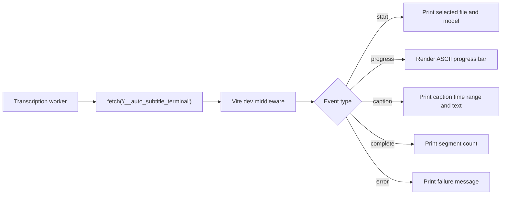

## Browser Diagnostic Reports

`DiagnosticLog` keeps a versioned, browser-local event stream in `localStorage`. It retains at most 1,000 recent events and trims toward an approximately 2 MB serialized budget. Storage failures are non-fatal: the active in-memory log continues even when local storage is disabled or full. Strings, arrays, object depth, chunks, and segment samples are bounded; truncated strings retain their original length plus head/tail samples.

The worker emits structured diagnostic events through the existing typed worker bridge. A full transcription report can include:

1. File metadata, requested settings, resolved model/runtime settings, and browser capabilities.
2. Decoded sample rate, sample count, duration, and RMS—never PCM samples or media bytes.
3. VAD speech regions and the exact sample-derived window plan.
4. Per-window timestamp mode, raw ASR text/chunk summaries, repetition evidence, normalized segments, and reconciliation counts.
5. Coverage gaps, repair plans, raw repair output, and accepted/rejected repair segments.
6. Timing before/after speech-boundary refinement and final formatted editor entries.
7. Regeneration profiles/candidates, cancellation, failures, and stack traces where available.

The top-toolbar **Debug log** action adds the current video metadata, settings, progress, subtitle count, and current subtitle summaries, then downloads a JSON report. Recognized text is intentionally included because it is needed to distinguish model hallucination from window reconciliation, repair, or formatting behavior. The UI and report both state that recognized text may be sensitive and that no audio/video bytes are included.

Terminal logging is dev-only:

1. `postTerminalLog` returns immediately unless `import.meta.env.DEV` is true.
2. Events are sent to `/__auto_subtitle_terminal`.
3. The Vite plugin exists only in serve mode through `apply: 'serve'`.
4. Fetch failures are swallowed so terminal logging never breaks transcription.

Terminal event types:

| Event | Payload | Terminal behavior |
| --- | --- | --- |
| `start` | file name, model id | Prints the file/model being transcribed. |
| `progress` | stage, message, progress | Renders one updating ASCII progress bar. |
| `caption` | start time, end time, text | Prints each generated caption as a separate line. |
| `complete` | segment count | Prints completion summary. |
| `error` | message | Prints failure summary. |

The terminal renderer:

1. Uses a 28-character progress bar.
2. Uses `#` for filled progress and `-` for remaining progress.
3. Pads or trims the active terminal line based on terminal width.
4. Finishes the active progress line before printing normal log lines.
5. Trims caption text to 180 characters and collapses whitespace.

## Windows Launcher Lifecycle

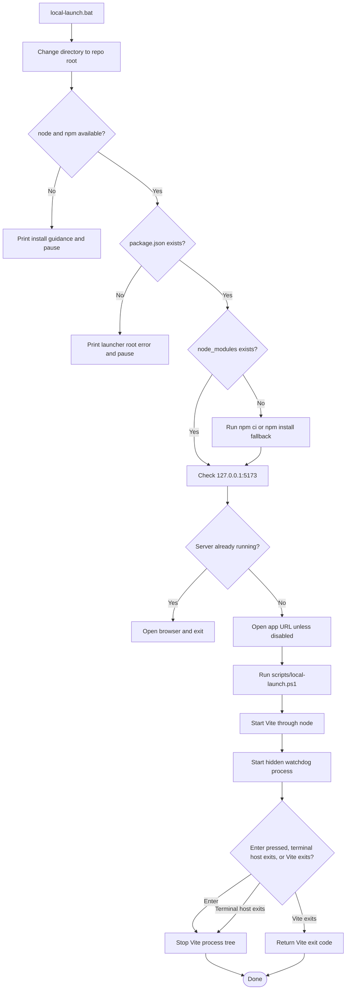

`local-launch.bat` is the user-facing launcher. It:

1. Changes to the repository root.
2. Checks for `node` and `npm`.
3. Checks for `package.json`.
4. Installs dependencies when `node_modules` does not exist.
5. Checks whether Vite is already listening on `127.0.0.1:5173`.
6. Opens `http://127.0.0.1:5173` unless `AUTO_SUBTITLE_NO_BROWSER=1`.
7. Starts `scripts/local-launch.ps1`.
8. Keeps the terminal open on errors.

`scripts/local-launch.ps1` starts Vite directly through Node and the local Vite CLI. It uses a watchdog mode:

1. The main PowerShell process identifies its terminal-host parent and starts the Vite process.
2. It starts a hidden watchdog with the terminal-host, main launcher, and Vite process ids.
3. The foreground loop stops Vite when Enter is pressed, console input closes, the terminal-host process exits, or Vite exits itself.
4. Independently, the watchdog stops the Vite process tree when either the terminal host or main launcher disappears.
5. If the terminal host disappeared while the main launcher survived without a console, the watchdog also terminates that stranded launcher process.

This prevents orphaned local dev server and launcher sessions when the terminal is closed. The lifecycle is manually verified by starting `local-launch.bat`, confirming port `5173` is listening, terminating the hosting `cmd.exe`, and confirming the listener and launcher helpers both disappear.

## Browser Capability Detection

`detectBrowserCapabilities` reports:

| Capability | Detection |
| --- | --- |
| WebAssembly | `typeof WebAssembly === 'object'` |
| Web Workers | `typeof Worker !== 'undefined'` |
| IndexedDB | `typeof indexedDB !== 'undefined'` |
| SharedArrayBuffer | `typeof SharedArrayBuffer !== 'undefined'` |
| Cross-origin isolation | `globalThis.crossOriginIsolated === true` |
| WebGPU | `navigator` has `gpu` |
| AudioContext | `AudioContext` or `webkitAudioContext` exists |
| WASM fallback | Same as WebAssembly availability |

Warnings are shown for missing WebAssembly, Web Workers, WebGPU, IndexedDB, and cross-origin isolation. Missing WebAssembly or Web Workers disables the transcription start button because the current implementation needs both.

Vite sets these headers in dev and preview:

```text
Cross-Origin-Embedder-Policy: require-corp
Cross-Origin-Opener-Policy: same-origin
```

Those headers support cross-origin isolation, which can unlock some browser execution paths for WASM and related workloads.

## Subtitle Data Model

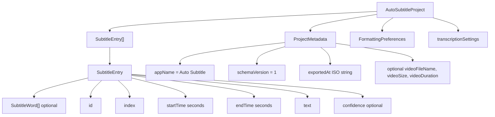

### `SubtitleEntry`

| Field | Type | Meaning |
| --- | --- | --- |
| `id` | `string` | Stable row identifier. Generated with `crypto.randomUUID()` when available. |
| `index` | `number` | One-based display/export order. Recomputed by sorting helpers. |
| `startTime` | `number` | Start time in seconds. |
| `endTime` | `number` | End time in seconds. |
| `text` | `string` | Display subtitle text. May contain line breaks. |
| `confidence` | `number \| undefined` | Optional confidence from future or imported sources. |
| `words` | `SubtitleWord[] \| undefined` | Optional word-level timing metadata. |

### `SubtitleWord`

| Field | Type | Meaning |
| --- | --- | --- |
| `text` | `string` | Word or token text. |
| `startTime` | `number` | Word start time in seconds. |
| `endTime` | `number` | Word end time in seconds. |
| `confidence` | `number \| undefined` | Optional confidence. |

### `AutoSubtitleProject`

| Field | Meaning |
| --- | --- |
| `metadata.appName` | Must be `Auto Subtitle`. |
| `metadata.schemaVersion` | Must be `1`. |
| `metadata.exportedAt` | ISO export time. |
| `metadata.videoFileName` | Optional hint used when restoring a project. |
| `metadata.videoSize` | Optional hint; the original video is not embedded. |
| `metadata.videoDuration` | Optional hint for duration comparison and validation. |
| `subtitles` | Sorted and renumbered subtitle list. |
| `formatting` | Formatting preferences active at export time. |
| `transcriptionSettings` | Optional copy of transcription settings. |

## Undo And Editing Model

`useUndoableSubtitles` stores:

```ts
{
  past: SubtitleEntry[][],
  present: SubtitleEntry[],
  future: SubtitleEntry[][]
}
```

Actions:

| Action | Behavior |
| --- | --- |
| `commit` | Sorts and renumbers new entries, pushes previous present into `past`, clears `future`, keeps the latest 80 past states. |
| `replace` | Sorts and renumbers entries and clears history. Used by transcription and imports. |
| `undo` | Moves the latest past state into present and pushes current present into future. |
| `redo` | Moves the first future state into present and pushes current present into past. |
| `clear` | Resets all history and entries. |

Editor operations call `commit`, while imports and transcription call `replace`.

## Subtitle Editor Behavior

The editor supports:

1. Search by subtitle text.
2. Previous and next search match navigation.
3. Filtering to rows with validation issues.
4. Auto-scroll to active subtitle.
5. Add a subtitle at the media element's exact current playhead position from the main Add button or empty-state action.
6. Pause playback at insertion time so the frame and captured timestamp remain stable while editing.
7. Insert the new entry chronologically with a two-second default duration, shortened at the known video end when needed.
8. Reveal the new row, focus its text area, and select the placeholder for immediate replacement; error-only filtering is disabled so the row cannot remain hidden.
9. Add before and add after relative to an existing row, with the new row focused immediately.
10. Open local range regeneration from any row when its source video is selected.
11. Adjust and validate a regeneration range up to 29 seconds.
12. Compare the current cues with up to three distinct local Whisper alternatives.
13. Preview a choice against video without committing it, then keep the original or apply one undoable replacement.
14. Delete.
15. Duplicate.
16. Split.
17. Merge previous and merge next.
18. Move up and move down.
19. Play only the current subtitle range.
20. Seek to the subtitle start.
21. Inline timestamp editing.
22. Inline text editing.
23. Text reformatting on blur.

The player uses the same `SubtitleEntry[]` and `commitSubtitleChanges` path. Its timeline positions cues by media time, provides 12/24/48/96 pixels-per-second zoom plus fit and follow modes, and renders active, selected, warning, and error states. Pointer-captured dragging previews locally and commits once on release; start/end handles enforce a positive range and prefer the configured minimum duration, while cue-body dragging preserves duration. Soft snapping prefers the playhead and neighboring boundaries before half-second marks, and unresolved overlaps remain ordinary validation issues.

Player insertion pauses the media element, captures its exact `currentTime`, creates the existing two-second manual cue (shortened at the known video end), reveals it if error filtering was active, selects it in both editors, and focuses player text. Fullscreen is requested on the entire player workspace so video, overlay, playback controls, timeline, editing panel, and mutation actions remain available. Narrow layouts keep the timeline horizontally scrollable and use a collapsible sticky editing panel.

Timestamp input accepts:

1. `HH:MM:SS.mmm`
2. `HH:MM:SS,mmm`
3. `MM:SS.mmm`
4. `MM:SS,mmm`
5. Raw seconds, such as `62.345`

It rejects negative times, malformed strings, minutes greater than or equal to 60 in clock formats, and seconds greater than or equal to 60 in clock formats.

## Validation Rules

`validateSubtitles(entries, duration?)` emits warning or error issues.

| Code | Level | Condition |
| --- | --- | --- |
| `malformed-time` | Error | Start or end time is not finite. |
| `negative-time` | Error | Start or end time is negative. |
| `invalid-range` | Error | End time is not after start time. |
| `beyond-duration` | Warning | Start or end time is beyond known video duration. |
| `empty-text` | Warning | Text is empty or whitespace. |
| `overlap` | Error | Subtitle overlaps the previous or next entry. |

Exports omit entries with validation errors and omit empty text. Warnings do not block export.

## Import Details

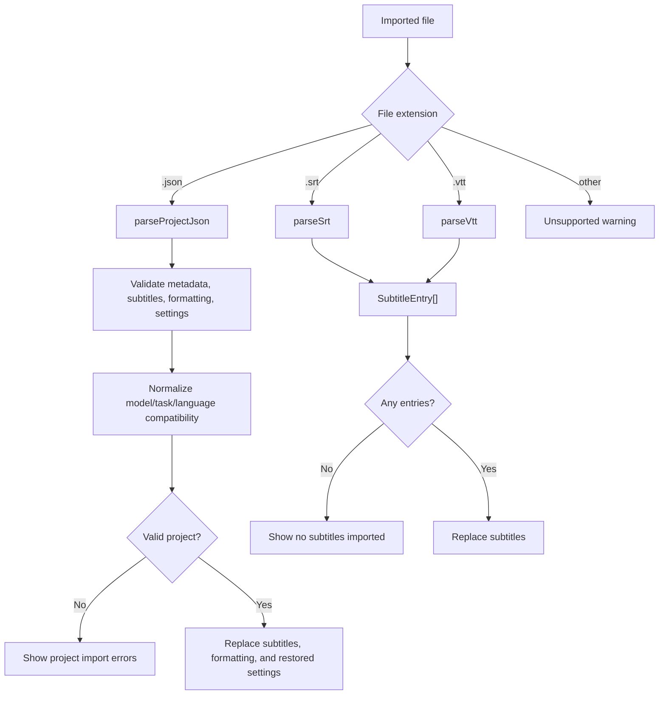

SRT parsing:

1. Normalizes newlines.
2. Splits blocks on blank lines.
3. Finds the first line containing `-->`.
4. Parses start and end times.
5. Joins remaining lines as text.
6. Skips malformed blocks with warnings.

VTT parsing:

1. Normalizes newlines and removes a UTF-8 BOM if present.
2. Warns if the file does not start with `WEBVTT`, but still parses leniently.
3. Removes the `WEBVTT` header.
4. Splits cue blocks on blank lines.
5. Skips `NOTE` blocks.
6. Parses cue timing and text.

Project JSON parsing:

1. Parses JSON.
2. Requires an object.
3. Requires `metadata.appName === 'Auto Subtitle'`.
4. Requires `metadata.schemaVersion === 1`.
5. Requires `subtitles` to be an array.
6. Normalizes each subtitle entry.
7. Normalizes formatting preferences with defaults for missing fields.
8. Preserves known model IDs, resolves incompatible combinations, and replaces unknown model IDs with Base without changing schema version.
9. Restores model, language, task, engine, dtype, chunk, overlap, and formatting settings, with missing legacy fields supplied from current defaults.
10. Reports a one-time warning when model compatibility changed during import.
11. Validates subtitles and fails import if validation errors exist.

Project JSON does not contain the original video file. On restore/import, the UI tells the user to select the original video again and includes saved filename and duration hints when available.

## Export Details

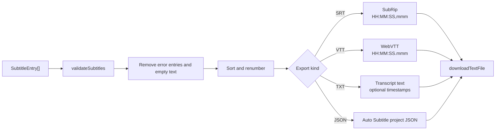

Export behavior:

| Export | File name | Contents |
| --- | --- | --- |
| SRT | `<video-base>.srt` | Numbered cues with comma milliseconds. |
| VTT | `<video-base>.vtt` | `WEBVTT` header and dot milliseconds. |
| TXT | `<video-base>.txt` | Plain transcript, one subtitle per line; optional timestamps. |
| JSON | `<video-base>.auto-subtitle.json` | Auto Subtitle project data with subtitles, formatting, metadata, and settings. |

`downloadTextFile` creates a `Blob`, creates an object URL, clicks a temporary anchor, then revokes the object URL.

## Autosave

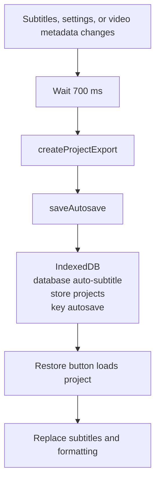

Autosave details:

| Item | Value |
| --- | --- |
| Database name | `auto-subtitle` |
| Version | `1` |
| Object store | `projects` |
| Key path | `key` |
| Autosave key | `autosave` |

Autosave stores project JSON data, not the original video. It includes video filename, size, and duration hints when known. Autosave can be restored or cleared from the toolbar.

## Theme Persistence

Theme preference is stored in localStorage under `auto-subtitle-theme`. Valid stored values are:

1. `light`
2. `dark`
3. `system`

When the preference is `system`, the app uses `window.matchMedia('(prefers-color-scheme: dark)')` to decide whether to set `document.documentElement.dataset.theme` to `dark` or `light`.

## Privacy And Data Movement

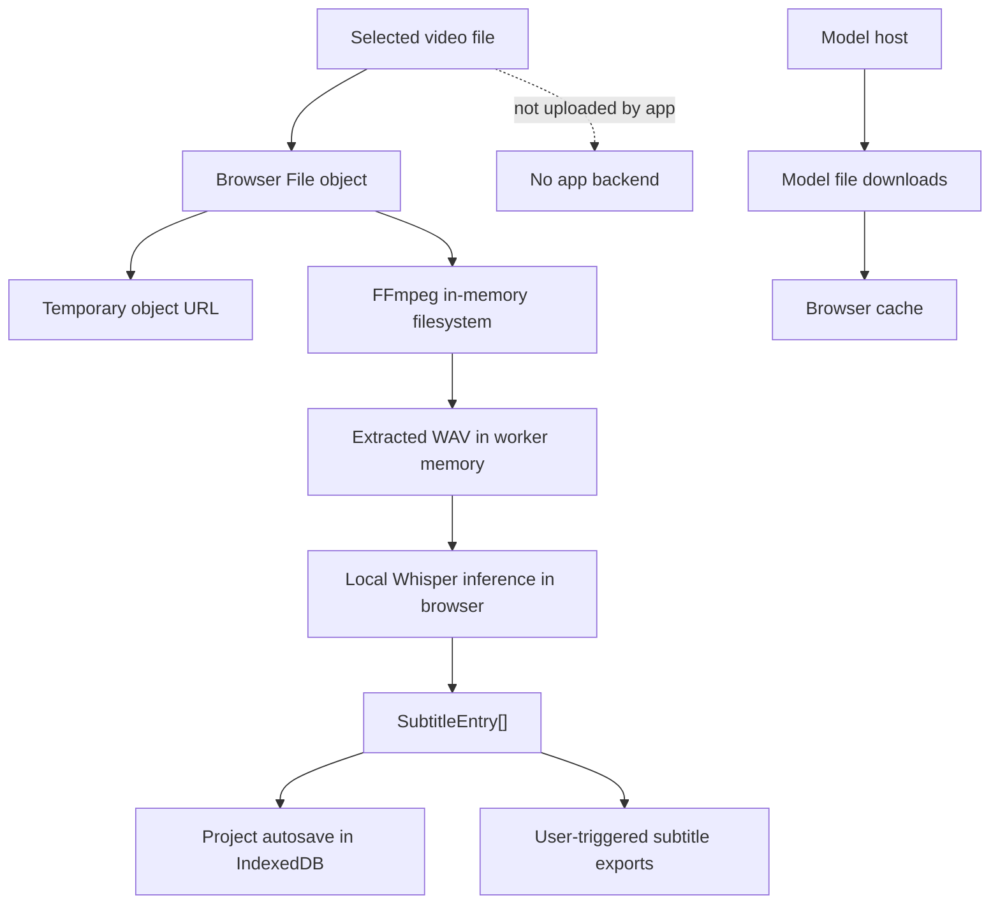

Important privacy facts:

1. The app has no application backend.
2. The selected video is not uploaded by the app.
3. The selected video is not stored in `public/`, the repo, or IndexedDB.
4. The original video is not included in project JSON exports.
5. Extracted audio is held in browser/worker memory.
6. Model files may be downloaded from the model host on first use and cached by the browser when supported.
7. Dev terminal progress is sent only to the local Vite server on `127.0.0.1`.
8. There is no analytics, tracking, authentication, Supabase, Firebase, or paid AI API integration.

## Error Handling

The app intentionally keeps errors visible:

| Failure point | Handling |
| --- | --- |
| Missing browser feature | Warning in transcription panel; WebAssembly or Worker absence disables transcription. |
| Bad video file | Validation errors in the drop zone. |
| Unreadable video duration | Error warning from video metadata handling. |
| FFmpeg load or exec failure | Worker error posts back to app; notice shows failure details. |
| Invalid WAV output | Worker throws `FFmpeg did not produce a valid WAV file.` |
| Unexpected WAV shape | Worker throws `Expected mono 16-bit PCM WAV audio.` |
| Silent extracted audio | Full transcription throws its existing silent-audio error; regeneration returns no alternatives and preserves current cues. |
| Model download or pipeline failure | Worker posts error with stack details when available. |
| Word timestamp unsupported | Worker retries with segment timestamps. |
| User cancellation | Progress becomes `cancelled`; busy state clears. |
| Invalid regeneration range | Dialog blocks non-finite, negative, empty, out-of-video, or longer-than-29-second requests before worker startup. |
| Empty or duplicate regeneration results | Dialog explains that no distinct timestamped alternative was found; original cues remain unchanged. |
| Regeneration failure or cancellation | Dedicated worker is terminated, temporary preview is cleared, and original cues remain unchanged. |
| Autosave load/save failure | Warning notice; app remains usable. |
| Import parse failure | Error notice with parse or validation details. |
| Export failure | Error notice with exception message. |

## Build And Development Configuration

`package.json` scripts:

| Script | Command | Purpose |
| --- | --- | --- |
| `dev` | `vite --host 127.0.0.1` | Start dev server. |
| `build` | `npm run typecheck && vite build` | Typecheck and produce production build. |
| `lint` | `oxlint` | Run lint checks. |
| `preview` | `vite preview --host 127.0.0.1` | Serve production build preview. |
| `test` | `vitest run` | Run tests. |
| `typecheck` | `tsc -b` | Typecheck TypeScript project references. |

Vite configuration:

1. Uses React plugin.
2. Adds `autoSubtitleTerminalPlugin`.
3. Runs dev server on `127.0.0.1:5173` with `strictPort`.
4. Runs preview on `127.0.0.1:4173` with `strictPort`.
5. Sets COOP and COEP headers for both dev and preview.
6. Uses ES module workers.
7. Excludes FFmpeg and Transformers packages from dependency optimization.
8. Configures Vitest with `jsdom` and globals.

## Testing Coverage

Current tests live under `src/tests/`, including dedicated speech-model compatibility and selector UI, speech activity, coverage, repair, timing refinement, settings compatibility, timestamp normalization, windowing, formatting/export, regeneration, audio extraction, and dialog suites.

They cover:

1. Timestamp parsing for clock and raw seconds formats.
2. Rejection of malformed timestamps.
3. SRT timestamp formatting.
4. VTT timestamp formatting.
5. SRT export.
6. VTT export.
7. SRT import with line breaks.
8. VTT cue import.
9. Sorting and renumbering.
10. Overlap validation.
11. Subtitle shifting without negative start times.
12. Split and merge behavior.
13. Long text formatting into readable lines.
14. Generated-caption line breaking that avoids unsafe phrase splits.
15. Generated-caption punctuation splitting.
16. Generated-caption reading-speed protection.
17. Generated-caption extension of very short captions toward readable minimum duration.
18. Generated-caption word-timestamp sync.
19. Generated-caption avoidance of abrupt word-timed cuts after very short phrases.
20. Generated-caption chaining of short safe gaps.
21. Generated-caption duplicate cleanup near chunk boundaries.
22. Live transcription preview replacement of pre-existing base subtitles.
23. Live transcription preview preservation of edited streamed rows.
24. Live transcription preview preservation of deleted streamed rows.
25. Valid project JSON round trip.
26. Malformed project rejection.
27. Suppression of late fallback captions for left-overlap-only ASR chunks.
28. Preservation of absolute timestamps when speech begins before a core's right boundary.
29. Onset-based single-core ownership for boundary-crossing chunks.
30. Rejection of long left-overlap chunks that would place subtitles into earlier silence.
31. Evidence-bounded low-confidence timing when a model returns text without usable timestamp chunks, plus suppression over silence.
32. Fixed and speech-aware model windows that include overlap without exceeding the 29-second safety budget.
33. Complete, contiguous core ownership across the full audio timeline.
34. Full-size cores when overlap is disabled and conservative clamping when overlap is excessive.
35. Timeline-preserving FFmpeg arguments for delayed audio-track starts.
36. Manual subtitle creation at the millisecond-rounded playhead time.
37. Manual cue duration shortening at the known end of a video.
38. Preservation of playhead timing while video metadata still reports an unknown zero duration.
39. Regeneration range validation and 29-second context budgeting.
40. Fixed bounded decoding profiles and normalized candidate deduplication.
41. Range-constrained segment timing and all-overlap cue replacement.
42. Neighbor-gap clamping without invented gaps at an open range boundary.
43. Regeneration dialog defaults, validation, preview, apply, original no-op, and Escape cancellation.
44. Registry recognition for all four model IDs and backward compatibility for Tiny/Base.
45. Distil English/transcription and Turbo transcription compatibility rules.
46. Deterministic fallback behavior for unknown, non-English, and translation settings.
47. Runtime enforcement of explicit English Distil ASR options.
48. High-resource WebGPU, precision, and CPU/WASM warnings.
49. Project model preservation, fallback normalization, and one-time warning details.
50. Selector model metadata, disabled incompatible options, high-resource guidance, and cache-accurate progress labels.
51. VAD silence rejection, speech detection, padding, merging, clamping, and analysis-failure fallback.
52. Speech-aware ownership coverage and safe splitting of long continuous regions.
53. Coverage interval calculation, material uncovered-range detection, and tiny-gap suppression.
54. Bounded repair planning, absolute repair offsets, nearby deduplication, and distant repeated-text preservation.
55. Safe speech-boundary snapping without adjacent overlap.
56. Adjacent-window duplicate removal and unique suffix/prefix word preservation.
57. Accurate-local defaults and schema-v1 missing-field normalization.
58. Valid export of low-confidence fallback cues while invalid entries remain omitted.
59. Bounded diagnostic persistence, oversized-text sampling, storage-failure fallback, and report metadata.
60. Raw ASR repetition/chunk summaries and normalized segment evidence.
61. Non-terminal worker diagnostic routing and the top-toolbar debug export action.
62. Timeline movement, resizing, minimum ranges, boundary clamping, snapping precedence, and overlap visibility.
63. Player timestamp editing, text formatting, navigation, duplication, deletion, and exact-playhead insertion callbacks.
64. Player/main-editor selection synchronization and mocked fullscreen entry, exit, and denial handling.

The tests focus on deterministic audio-extraction arguments, transcription-window and regeneration-range planning, subtitle utilities, timestamp normalization, dialog behavior, and generated-caption post-processing. They do not run a real model regeneration because that would require FFmpeg.wasm, model downloads, browser worker execution, and substantial runtime.

## Keyboard Shortcuts

| Shortcut | Behavior |
| --- | --- |
| Space | Toggle play/pause when focus is not in an input, textarea, select, or contenteditable element. |
| Arrow Left | Seek backward 5 seconds. |
| Arrow Right | Seek forward 5 seconds, clamped to video duration when known. |
| Ctrl+Z or Cmd+Z | Undo subtitle edit. |
| Ctrl+Shift+Z, Cmd+Shift+Z, Ctrl+Y, or Cmd+Y | Redo subtitle edit. |
| Enter on a subtitle row | Seek to that subtitle's start time. |
| Enter or Space on a timeline cue | Select the cue and seek to its start. |
| Arrow Left or Arrow Right on a timeline cue | Move the cue by 0.1 seconds; hold Shift for 0.5 seconds. |
| Arrow Left or Arrow Right on a focused timeline handle | Adjust its start or end boundary by 0.1 seconds; hold Shift for 0.5 seconds. |

## Known Limitations

1. Browser transcription can require significant memory and time for large videos.
2. FFmpeg.wasm writes the selected file into an in-memory filesystem before extraction, so video processing is not streaming.
3. The extracted audio buffer is held in browser memory.
4. Browser codec support varies by browser and source file.
5. WebGPU support varies by device and browser.
6. Model download size can be large on first run.
7. Word-level timestamps depend on the selected model export; unsupported models fall back to segment timestamps.
8. Chunk-boundary quality can vary. The worker prefers VAD silence boundaries, keeps overlap inside a 29-second input budget, reconciles nearby overlap tokens, and uses onset-based ownership, but manual review is still expected.
9. Speech activity analysis can be imperfect on music, sustained noise, overlapping speakers, and very quiet speech. Speech it fails to detect cannot trigger coverage repair.
10. Coverage recovery is deliberately bounded to one pass and at most 20 ranges; it reduces likely omissions but cannot guarantee complete transcripts.
11. Generated subtitle timing is improved with word timestamp padding, speech-boundary snapping, reading-speed checks, and overlap cleanup, but it is not guaranteed perfect.
12. Project JSON does not embed the original video, so users must reselect the video after restoring a project.
13. Current automated tests do not execute the full FFmpeg plus Whisper pipeline.
14. Regeneration reinitializes a worker and model pipeline for every request. Browser caching avoids redownloading unchanged files, but initialization and bounded extraction still take time.

## Extension Points

The app has a small transcription provider boundary. A future local engine could be added by matching the same concepts:

1. Accept a `File` and `TranscriptionSettings`.
2. Report `TranscriptionProgress`.
3. Resolve to `TranscriptionResult`.
4. Return `RawTranscriptionSegment[]`.
5. Let `formatTranscriptionSegments` convert results into `SubtitleEntry[]`.

Other natural extension points:

1. More spoken language options.
2. Streaming or media-pipeline-based audio extraction for lower memory use.
3. Waveform-based timing adjustment.
4. More import/export formats.
5. More advanced subtitle timing controls for reviewing generated captions.
6. Screenshot documentation in the README.

## End-To-End Summary

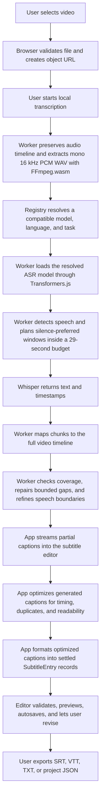

Auto Subtitle's central invariant is that everything becomes editable subtitle entries. The app's transcription system, importers, manual editor, preview overlay, autosave, and exporters all orbit that one data model.
