# Auto Subtitle Project State

This document describes the current implementation of Auto Subtitle: what the app is, how it is structured, how users move through it, how videos become editable subtitle entries, how local model execution is wired, and where state is stored.

Auto Subtitle is a local-first React web application for generating, editing, importing, previewing, and exporting subtitles for videos selected from the user's computer. The app is intentionally browser-centered: there is no application backend, no user account system, no database service, no cloud transcription API, no analytics, and no upload path for user media.

## Current Snapshot

| Area | Current state |
| --- | --- |
| Product name | Auto Subtitle |
| Repository | `zxyandreay/auto-subtitle` |
| Package name | `auto-subtitle` |
| Runtime | Browser app served by Vite |
| Frontend | React 19, TypeScript, CSS |
| Local media processing | FFmpeg.wasm |
| Local speech recognition | Transformers.js automatic speech recognition pipeline with Whisper ONNX models |
| Persistence | Browser IndexedDB autosave and localStorage theme preference |
| Import formats | SRT, WebVTT, Auto Subtitle project JSON |
| Export formats | SRT, WebVTT, TXT transcript, Auto Subtitle project JSON |
| Launcher | `local-launch.bat` plus `scripts/local-launch.ps1` |
| Dev terminal telemetry | Vite middleware endpoint at `/__auto_subtitle_terminal` |
| Tests | Vitest tests for timestamp, subtitle, import, export, project, and editing utilities |

## Product Goals

Auto Subtitle is built around these implementation principles:

1. Keep the user's media local to the browser whenever possible.
2. Make transcription failures visible instead of fabricating subtitle output.
3. Keep manual editing, import, export, and autosave useful even when transcription cannot run.
4. Treat generated subtitles as a draft that the user reviews before export.
5. Keep the transcription boundary small so another local engine can be added later without rewriting the editor.
6. Use deterministic subtitle data structures after import or transcription so all editor, preview, validation, autosave, and export paths share the same source of truth.

## High-Level Architecture

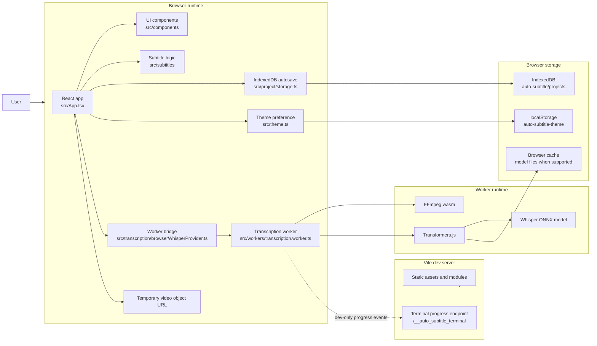

The core design is a single-page app with a worker-backed transcription provider. All generated or imported subtitles become `SubtitleEntry[]`. Once subtitle entries exist, the app does not care whether they came from Whisper, SRT, WebVTT, project JSON, or manual entry.

## Runtime Boundaries

| Boundary | Files | Responsibility |
| --- | --- | --- |
| Browser app | `src/main.tsx`, `src/App.tsx`, `src/components/*` | Renders the workspace, owns top-level state, connects user actions to subtitle operations. |
| Subtitle domain logic | `src/subtitles/*`, `src/types/subtitles.ts`, `src/utils/time.ts` | Parses, formats, validates, imports, exports, splits, merges, shifts, normalizes, and renumbers subtitles. |
| Transcription provider | `src/transcription/browserWhisperProvider.ts`, `src/transcription/types.ts`, `src/transcription/capabilities.ts` | Starts and cancels the transcription worker, exposes progress, partial-result, and final-result callbacks, detects browser capability warnings. |
| Worker implementation | `src/workers/transcription.worker.ts` | Runs FFmpeg.wasm, decodes audio, loads the ASR model, transcribes audio windows, normalizes timestamps, posts progress, partial results, and final results. |
| Live preview merging | `src/subtitles/livePreview.ts` | Merges streamed generated subtitles into the editor while preserving user edits and deletions during an active transcription. |
| Project storage | `src/project/storage.ts` | Stores and restores project autosave records in IndexedDB. |
| Vite dev server | `vite.config.ts` | Serves the app, applies cross-origin isolation headers, excludes heavy WASM dependencies from optimization, exposes terminal progress middleware in dev. |
| Windows launcher | `local-launch.bat`, `scripts/local-launch.ps1` | Installs dependencies if needed, starts Vite, opens the browser, and stops the Vite process tree when the user presses Enter or closes the launcher session. |

## Repository Map

```text
.
|-- docs/
|   `-- project-state.md
|-- local-launch.bat
|-- scripts/
|   `-- local-launch.ps1
|-- src/
|   |-- App.tsx
|   |-- main.tsx
|   |-- components/
|   |-- hooks/
|   |-- media/
|   |-- project/
|   |-- subtitles/
|   |-- tests/
|   |-- transcription/
|   |-- types/
|   |-- utils/
|   `-- workers/
|-- public/
|-- vite.config.ts
|-- package.json
|-- package-lock.json
|-- tsconfig*.json
`-- README.md
```

## Application Entry And Top-Level State

`src/main.tsx` mounts `App` into `#root` under React `StrictMode`.

`src/App.tsx` owns the main runtime state:

| State | Purpose |
| --- | --- |
| `theme` | Current theme preference: `light`, `dark`, or `system`. |
| `video` | Selected browser `File`, temporary object URL, and discovered duration. |
| `videoWarnings` / `videoErrors` | Validation feedback for file type, file size, file emptiness, and unreadable metadata. |
| `currentTime` | Current playback position in seconds. |
| `subtitlesVisible` | Whether the overlay is visible in the video player. |
| `settings` | Transcription and formatting settings. |
| `progress` | Current transcription stage, message, determinate progress, and optional technical details. |
| `busy` | Whether a transcription job is active. |
| `notice` | Dismissible success, warning, or error banner. |
| `autosave` | Loaded autosave metadata and project contents. |
| `autoScroll` | Whether the editor scrolls the active subtitle into view. |
| `showOnlyErrors` | Whether the editor filters rows to entries with validation issues. |
| `shiftMilliseconds` | Global timing shift amount. |
| `includeTranscriptTimestamps` | Whether TXT export includes timestamps. |
| `seekRequest` | Imperative seek request sent to the video player. |
| `playRangeRequest` | Imperative range-play request sent to the video player. |
| `playToggleRequest` | Imperative keyboard play/pause toggle sent to the video player. |
| `jobRef` | Current `TranscriptionJob` for cancellation. |
| `useUndoableSubtitles()` | Subtitle history state: `past`, `present`, and `future`. |

The top-level app wires browser events and side effects:

1. Applies and saves theme changes.
2. Loads IndexedDB autosave on mount.
3. Debounces autosave writes by 700 milliseconds after subtitle, settings, or video metadata changes.
4. Revokes temporary video object URLs when replacing or unmounting a video.
5. Cancels active transcription jobs when the app unmounts.
6. Registers keyboard shortcuts for playback, seeking, undo, and redo.

## User Interface Composition

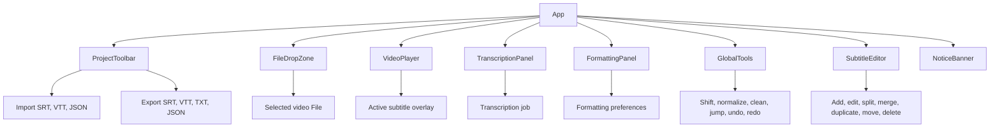

### Component Responsibilities

| Component | File | Main responsibility |
| --- | --- | --- |
| `ProjectToolbar` | `src/components/ProjectToolbar.tsx` | Project-level actions: import, restore autosave, export, clear autosave, clear subtitles, and theme selection. |
| `FileDropZone` | `src/components/FileDropZone.tsx` | Drag/drop and file picker for video files, file facts, validation messages, and removal. |
| `VideoPlayer` | `src/components/VideoPlayer.tsx` | HTML video preview, playback controls, range seek, volume, fullscreen, subtitle overlay, active subtitle lookup. |
| `TranscriptionPanel` | `src/components/TranscriptionPanel.tsx` | Language/model/engine/chunk settings, capability warnings, determinate progress display, start/cancel buttons. |
| `FormattingPanel` | `src/components/FormattingPanel.tsx` | Formatting preferences and reapply formatting action. |
| `SubtitleEditor` | `src/components/SubtitleEditor.tsx` | Editable subtitle rows, timestamp parsing, row actions, search, active-row auto-scroll, validation issue display. |
| `IconButton` | `src/components/IconButton.tsx` | Shared accessible icon button with `aria-label` and `title`. |

## Primary User Flow: Video To Subtitles

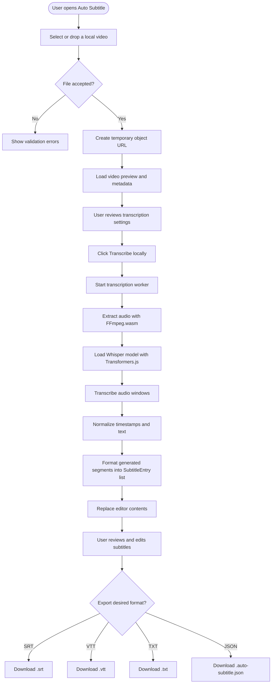

The selected video remains a browser `File`. The app creates a temporary object URL for playback and revokes it when the video is replaced, removed, or the app unmounts.

## Import, Edit, Preview, Export Flow

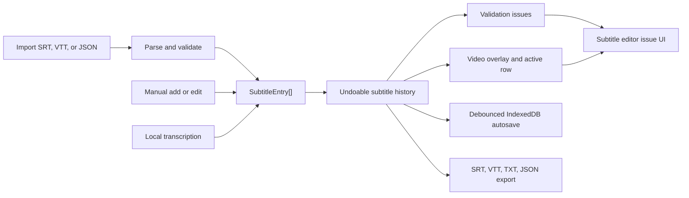

Once entries exist, all paths converge:

1. `useUndoableSubtitles` stores the current list and up to 80 past states for undo.
2. `validateSubtitles` marks malformed times, negative times, invalid ranges, duration overflow, empty text, and overlaps.
3. The video player finds the active subtitle by comparing `currentTime` to entry `startTime` and `endTime`.
4. Autosave serializes project JSON into IndexedDB.
5. Exporters filter out entries with validation errors and empty text before producing SRT, VTT, or TXT.

## Transcription Pipeline Overview

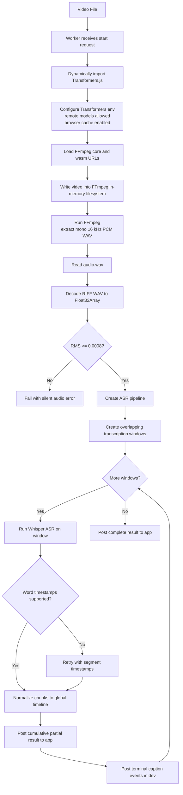

## Worker Message Flow

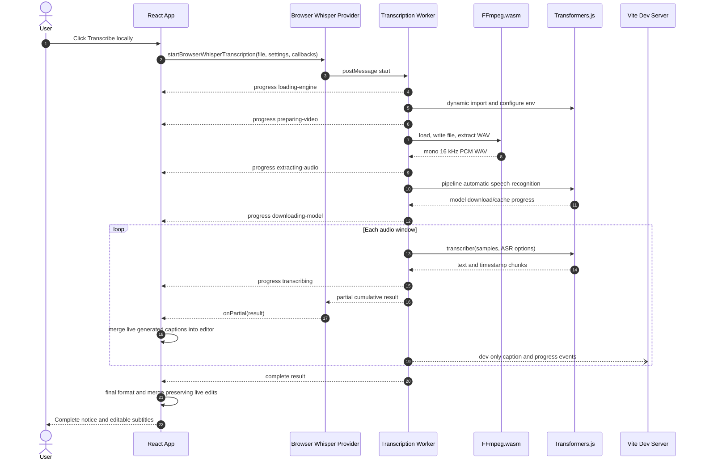

Cancellation is user-driven from the `Cancel` button or app teardown:

1. `TranscriptionJob.cancel()` posts a `cancel` request to the worker.
2. The provider terminates the worker immediately.
3. The promise rejects with `Transcription cancelled by the user.`
4. The app marks the progress stage as `cancelled`, keeps the current progress value, clears busy state, and leaves the editor ready for manual work or imports.

The worker also checks `assertNotCancelled()` between major steps so cooperative cancellation can stop long flows when the worker has not already been terminated.

Live partial previews use the same local worker path. After each completed audio window, the worker posts a non-terminal `partial` event with the cumulative raw segments. The provider forwards that event through `onPartial`, and the app formats those generated segments into preview subtitles. The editor receives the preview subtitles immediately, so the user can seek, preview, and edit captions before the final transcription result arrives.

The live preview merge keeps user changes stable while the worker continues:

1. Existing subtitles from before transcription are treated as the base that the generated result will replace.
2. Streamed generated rows are tracked by id.
3. If the user edits a streamed row, later partial updates preserve that edited row.
4. If the user deletes a streamed row, later partial updates do not re-add that same generated row.
5. User-added rows created during transcription are kept alongside streamed generated rows.
6. Final completion applies the full generated-caption optimization again and merges it with any preserved live edits before settling the editor state.

## Detailed Video Processing

### 1. Video Selection

`FileDropZone` accepts file picker input and drag/drop input. The accepted extensions and MIME types are defined in `src/media/video.ts`:

| Accepted extension | Accepted MIME type |
| --- | --- |
| `.mp4` | `video/mp4` |
| `.webm` | `video/webm` |
| `.mov` | `video/quicktime` |
| `.mkv` | `video/x-matroska` |

Validation checks:

1. Rejects files that have neither an accepted extension nor an accepted MIME type.
2. Rejects empty files.
3. Warns when file size is greater than 500 MB.
4. Warns when browser-discovered duration is greater than 30 minutes.
5. Reports a metadata error if the browser cannot read a finite duration.

When validation succeeds:

1. Any previous object URL is revoked.
2. A new `URL.createObjectURL(file)` is created.
3. `video` state becomes `{ file, objectUrl, duration: 0 }`.
4. The preview video loads metadata and reports duration back to the app.

### 2. Transcription Job Creation

When the user starts transcription, `App`:

1. Clears the current notice.
2. Sets `busy` to `true`.
3. Sets progress to `loading-engine` with progress `0.01`.
4. Calls `startBrowserWhisperTranscription(video.file, settings, { onProgress: setProgress })`.
5. Stores the returned job in `jobRef` for cancellation.

The provider creates a module worker:

```ts
new Worker(new URL('../workers/transcription.worker.ts', import.meta.url), {
  type: 'module',
})
```

The provider listens for three worker outcomes:

| Worker event | Provider behavior |
| --- | --- |
| `progress` | Calls `callbacks.onProgress(data.progress)`. |
| `complete` | Terminates the worker and resolves the job promise. |
| `error` | Terminates the worker and rejects the job promise. |

### 3. Worker Initialization

The worker receives `{ type: 'start', file, settings }`, resets cancellation state, creates a job id, resets monotonic progress, and starts `transcribe(file, settings)`.

The worker dynamically imports Transformers.js:

```ts
const { env, pipeline } = await import('@huggingface/transformers')
```

Then it configures the Transformers.js environment:

| Setting | Value | Meaning |
| --- | --- | --- |
| `env.allowLocalModels` | `false` | The browser build does not expect bundled local model files. |
| `env.allowRemoteModels` | `true` | Model files can be downloaded from the configured model host. |
| `env.useBrowserCache` | `true` | Browser cache is used when supported so later runs can avoid redownloading unchanged model files. |

### 4. Audio Extraction With FFmpeg.wasm

`extractAudio(file)` performs local audio conversion in the worker:

1. Creates a new `FFmpeg` instance.
2. Subscribes to FFmpeg progress events and maps them to app progress.
3. Loads the FFmpeg core and WASM URLs imported through Vite:
   - `@ffmpeg/core?url`
   - `@ffmpeg/core/wasm?url`
4. Writes the selected browser file into FFmpeg's in-memory filesystem with `fetchFile(file)`.
5. Executes FFmpeg with these arguments:

```text
-i input-<timestamp>
-vn
-ac 1
-ar 16000
-acodec pcm_s16le
-f wav
audio.wav
```

The output is mono, 16 kHz, signed 16-bit PCM WAV. This shape is chosen because Whisper expects audio that can be converted into consistent speech features, and Transformers.js can consume the resulting numeric samples.

The worker then:

1. Reads `audio.wav` from FFmpeg's filesystem.
2. Deletes input and output files on a best-effort basis.
3. Terminates FFmpeg.
4. Decodes the WAV bytes manually.

### 5. WAV Decoding

`decodePcmWav(bytes)` parses the WAV container:

1. Reads `RIFF` at byte 0 and `WAVE` at byte 8.
2. Iterates chunks from byte 12.
3. Reads the `fmt ` chunk to discover channels, sample rate, and bits per sample.
4. Finds the `data` chunk.
5. Requires mono, 16-bit PCM data.
6. Converts each signed 16-bit little-endian sample into a float in the range approximately `-1` to `1` by dividing by `32768`.

The resulting object is:

```ts
{
  samples: Float32Array
  sampleRate: number
}
```

The worker computes a sampled RMS value with `calculateRms`. If RMS is below `0.0008`, the worker fails with `The extracted audio appears to be empty or silent.`

### 6. Whisper Model Loading

The app currently exposes two model options:

| UI label | Model id | Intended tradeoff |
| --- | --- | --- |
| Faster model | `onnx-community/whisper-tiny` | Smaller, faster, lower memory, less accurate. |
| More accurate model | `onnx-community/whisper-base` | Larger, slower, higher memory, usually more accurate. |

The worker creates a Transformers.js pipeline:

```ts
pipeline('automatic-speech-recognition', settings.modelId, {
  device: settings.executionProvider,
  dtype: settings.dtype === 'auto' ? undefined : settings.dtype,
  progress_callback: ...
})
```

Current `executionProvider` choices:

| Setting | Meaning |
| --- | --- |
| `auto` | Let Transformers.js choose an available execution path. |
| `webgpu` | Prefer WebGPU where available. |
| `wasm` | Prefer WebAssembly. |
| `cpu` | Use CPU execution path. |

Current `dtype` choices in the type model are `auto`, `q8`, and `fp32`. The UI currently leaves dtype at the default `auto`; if it is not `auto`, the worker passes the dtype through to the pipeline.

Model download/cache progress is translated from Transformers.js progress callback payloads. The worker supports payloads with either:

1. A numeric `progress` percentage, or
2. Numeric `loaded` and `total` byte counts.

The user sees those as determinate progress updates when available.

## How Whisper Works In This App

Whisper is an encoder-decoder transformer model for speech recognition and speech translation. In Auto Subtitle, the user does not interact with the model directly. The worker passes normalized audio samples to a Transformers.js automatic speech recognition pipeline, and that pipeline handles the model-specific preprocessing and decoding.

Conceptually, the pipeline does the following:

1. Converts raw audio samples into the acoustic features expected by Whisper.
2. Runs the Whisper encoder to create latent speech representations.
3. Runs the Whisper decoder to generate tokens for the selected task.
4. Decodes tokens into text.
5. When timestamps are requested, returns timestamped chunks that the app can map to subtitle ranges.

The app configures the model through these user-facing settings:

| Setting | Worker option | Effect |
| --- | --- | --- |
| Spoken language | `language` | `auto` becomes `undefined`; a selected language is passed to the ASR call. |
| Output | `task` | `transcribe` keeps the source language; `translate` asks Whisper for English output. |
| Model | `modelId` | Chooses tiny or base ONNX Whisper repository. |
| Engine | `device` | Chooses auto, WebGPU, WASM, or CPU execution provider. |
| Use word timestamps | `return_timestamps` | Uses `'word'` when enabled; otherwise uses segment timestamps. |

The worker calls the transcriber with:

```ts
{
  return_timestamps: true | 'word',
  chunk_length_s: 0,
  stride_length_s: 0,
  language: settings.language === 'auto' ? undefined : settings.language,
  task: settings.task
}
```

`chunk_length_s` and `stride_length_s` are set to `0` because Auto Subtitle performs its own explicit audio windowing before calling the model. This gives the app direct control over progress, caption preview events, overlap, and timeline normalization.

## Audio Windowing And Timestamp Normalization

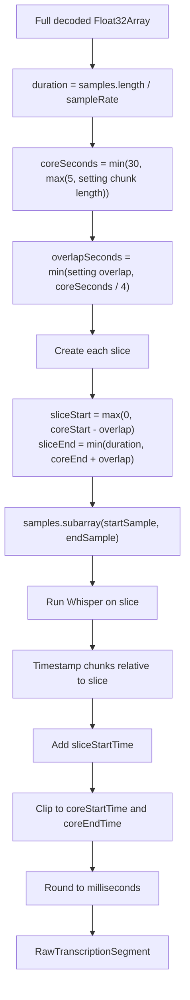

Windowing details:

1. The configured chunk length is bounded by the worker to a minimum of 5 seconds and a maximum of 30 seconds.
2. The configured overlap is bounded to no more than one quarter of the core window.
3. Each window has a core region and optional surrounding overlap.
4. The ASR result is converted back to the full-video timeline by adding `sliceStartTime`.
5. Chunks that only belong to the neighboring overlap are discarded.
6. Remaining chunks are clipped to the core window.
7. Times are rounded to three decimal places.

This design makes progress predictable and lets the terminal show captions as each window completes. The overlap gives Whisper context near boundaries, while core clipping limits duplicate subtitles around window edges.

## Timestamp Modes And Fallback

The worker supports two timestamp modes:

| Mode | Trigger | Result |
| --- | --- | --- |
| Segment timestamps | Default | Returns larger timestamped chunks suitable for subtitles. |
| Word timestamps | Enabled by formatting preference `useWordTimestamps` | Attempts word-level timing. |

Some exported Whisper models do not expose cross-attention outputs needed for word-level timestamps. When word timestamps fail with known messages such as `Model outputs must contain cross attentions to extract timestamps`, `token-level timestamps not available`, or `output_attentions=True`, the worker retries the current window with segment timestamps and uses segment timestamps for later windows.

This avoids failing the entire transcription just because word-level timestamps are not supported by the selected model export.

## ASR Result Normalization

The worker receives an unknown result shape from the pipeline and normalizes defensively:

1. If the result is an array, it reads the first item.
2. If `text` is present and is a string, it trims and stores it.
3. If `chunks` is present and is an array, each chunk is inspected.
4. A valid chunk must have:
   - `timestamp` as an array
   - numeric start and end values
   - finite times
   - `end > start`
   - `text` as a string
5. Invalid chunks are dropped.
6. Valid chunks are placed on the full timeline and clipped to the core window.
7. If no valid chunks remain but fallback text exists, a fallback segment is created for the core window.

When many chunks look word-level, the worker combines them into a single segment with a `words` array. Later formatting can split those words into readable subtitle entries if word timestamps are enabled.

## Formatting Generated Subtitles

`formatTranscriptionSegments` converts worker `RawTranscriptionSegment[]` into editor `SubtitleEntry[]`.

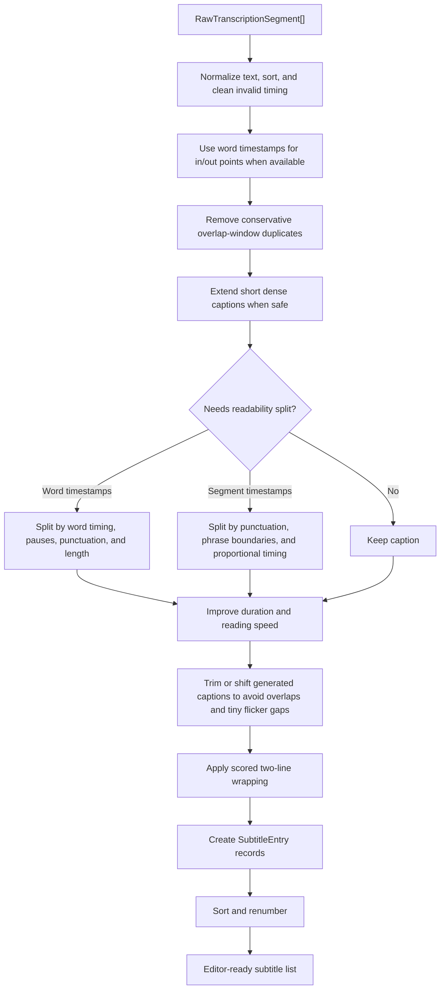

Formatting preferences:

| Preference | Default | Used for |
| --- | --- | --- |
| `maxCharsPerLine` | `42` | Splitting visible subtitle text into readable lines. |
| `maxCharsPerSubtitle` | `84` | Splitting long generated segments or grouping words. |
| `minDuration` | `1.1` | Enforcing readable minimum subtitle duration during overlap normalization. |
| `maxDuration` | `6` | Splitting overly long generated segments or word groups. |
| `gapBetweenSubtitles` | `0.04` | Preventing back-to-back overlap after normalization. |
| `useWordTimestamps` | `false` | Choosing word-level grouping when supported. |

Text formatting behavior:

1. Normalizes CRLF to LF.
2. Collapses repeated whitespace inside each line.
3. Removes empty lines.
4. Removes near-duplicate generated captions from overlapping audio windows when adjacent text and timing are highly similar.
5. Splits long generated captions first at sentence punctuation, then softer punctuation, then natural phrase boundaries.
6. Wraps text with a scored two-line line-breaker that prefers balanced lines and avoids unsafe phrase breaks.
7. Limits final generated caption display to at most two visible lines.
8. Attempts to balance a short second line by moving a final word when useful.

Timing formatting behavior:

1. Times are rounded to milliseconds.
2. Times are clamped to zero and optionally to video duration.
3. When usable word timestamps exist, generated caption starts prefer the first word start with about 0.08 seconds of lead-in.
4. When usable word timestamps exist, generated caption ends prefer the last word end with about 0.18 seconds of tail padding.
5. Segment-level timing remains the fallback when word timestamps are absent or incomplete.
6. Generated captions target a maximum reading speed of about 21 characters per second.
7. Dense generated captions are extended when safe, then split if they still exceed readability limits.
8. Entries are sorted by start time and end time.
9. Indices are recalculated from 1.
10. Overlaps are resolved by trimming or shifting generated captions while preserving the configured technical gap.
11. Tiny safe gaps are chained to reduce visible flicker.

Generated-caption helper responsibilities:

| Helper | Purpose |
| --- | --- |
| `optimizeGeneratedCaptions` | Runs the generated-only post-processing pipeline before `SubtitleEntry` creation. |
| `calculateCharactersPerSecond` | Measures readable text density over caption duration. |
| `calculateReadableDuration` | Computes a deterministic readable duration target from text length and formatting preferences. |
| `needsSplitForReadability` | Decides whether a generated caption needs timing extension or segmentation. |
| `normalizeForDuplicateComparison` | Canonicalizes generated text for conservative duplicate detection. |
| `tokenSimilarity` | Compares adjacent generated captions for overlap-window duplicate cleanup. |
| `dedupeOverlappingSegments` | Removes or safely merges adjacent duplicate generated segments near chunk boundaries. |

## Live Subtitle Preview While Transcribing

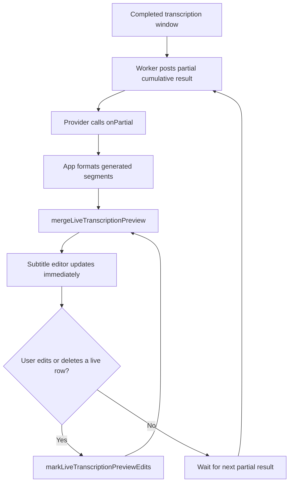

Live preview details:

1. Partial results are local worker messages; they do not add a backend or external transcription service.
2. The worker sends cumulative raw segments after each audio window finishes.
3. The app formats partial segments with the same generated-caption optimizer used for the final result.
4. `useUndoableSubtitles.preview` updates the current editor contents without adding automatic worker updates to the undo history.
5. `mergeLiveTranscriptionPreview` removes the pre-transcription base entries once generated captions arrive, matching final transcription replacement behavior.
6. User edits and deletions to streamed generated rows are tracked and preserved across later partial updates.
7. Rows the user adds manually during transcription are kept alongside streamed generated rows.

## Progress Model

The worker emits semantic stages and maps them to monotonic overall progress. The browser progress bar and the local launcher terminal both consume the same overall values.

| Stage | Overall progress mapping |
| --- | --- |
| `loading-engine` | `0.02` |
| `preparing-video` | `0.06` |
| `extracting-audio` | `0.08 + stageProgress * 0.22` |
| `downloading-model` | `0.30 + stageProgress * 0.25` |
| `transcribing` | `0.55 + stageProgress * 0.40` |
| `formatting-subtitles` | `0.97` |
| `complete` | `1.00` |
| `cancelled` / `failed` | Keep last known progress |

`lastOverallProgress` ensures progress never moves backwards, even if a lower-level callback emits a smaller value than a previous callback.

Browser UI behavior:

1. If `progress.progress` exists, `TranscriptionPanel` shows a native determinate `<progress>` element and a percent label.
2. If no determinate progress exists while busy, the panel can show an indeterminate animation.
3. Current implementation provides determinate values for all worker progress stages.

## Terminal Progress And Captions

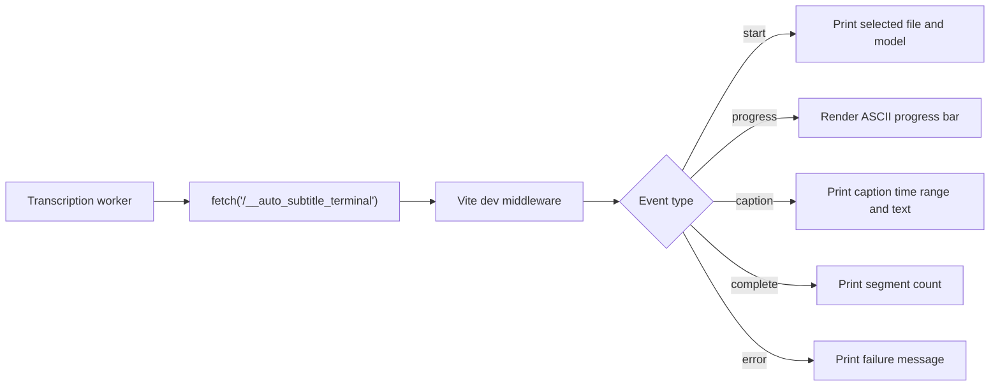

Terminal logging is dev-only:

1. `postTerminalLog` returns immediately unless `import.meta.env.DEV` is true.
2. Events are sent to `/__auto_subtitle_terminal`.
3. The Vite plugin exists only in serve mode through `apply: 'serve'`.
4. Fetch failures are swallowed so terminal logging never breaks transcription.

Terminal event types:

| Event | Payload | Terminal behavior |
| --- | --- | --- |
| `start` | file name, model id | Prints the file/model being transcribed. |
| `progress` | stage, message, progress | Renders one updating ASCII progress bar. |
| `caption` | start time, end time, text | Prints each generated caption as a separate line. |
| `complete` | segment count | Prints completion summary. |
| `error` | message | Prints failure summary. |

The terminal renderer:

1. Uses a 28-character progress bar.
2. Uses `#` for filled progress and `-` for remaining progress.
3. Pads or trims the active terminal line based on terminal width.
4. Finishes the active progress line before printing normal log lines.
5. Trims caption text to 180 characters and collapses whitespace.

## Windows Launcher Lifecycle


`local-launch.bat` is the user-facing launcher. It:

1. Changes to the repository root.
2. Checks for `node` and `npm`.
3. Checks for `package.json`.
4. Installs dependencies when `node_modules` does not exist.
5. Checks whether Vite is already listening on `127.0.0.1:5173`.
6. Opens `http://127.0.0.1:5173` unless `AUTO_SUBTITLE_NO_BROWSER=1`.
7. Starts `scripts/local-launch.ps1`.
8. Keeps the terminal open on errors.

`scripts/local-launch.ps1` starts Vite directly through Node and the local Vite CLI. It uses a watchdog mode:

1. The main PowerShell process identifies its terminal-host parent and starts the Vite process.
2. It starts a hidden watchdog with the terminal-host, main launcher, and Vite process ids.
3. The foreground loop stops Vite when Enter is pressed, console input closes, the terminal-host process exits, or Vite exits itself.
4. Independently, the watchdog stops the Vite process tree when either the terminal host or main launcher disappears.
5. If the terminal host disappeared while the main launcher survived without a console, the watchdog also terminates that stranded launcher process.

This prevents orphaned local dev server and launcher sessions when the terminal is closed. The lifecycle is manually verified by starting `local-launch.bat`, confirming port `5173` is listening, terminating the hosting `cmd.exe`, and confirming the listener and launcher helpers both disappear.

## Browser Capability Detection

`detectBrowserCapabilities` reports:

| Capability | Detection |
| --- | --- |
| WebAssembly | `typeof WebAssembly === 'object'` |
| Web Workers | `typeof Worker !== 'undefined'` |
| IndexedDB | `typeof indexedDB !== 'undefined'` |
| SharedArrayBuffer | `typeof SharedArrayBuffer !== 'undefined'` |
| Cross-origin isolation | `globalThis.crossOriginIsolated === true` |
| WebGPU | `navigator` has `gpu` |
| AudioContext | `AudioContext` or `webkitAudioContext` exists |
| WASM fallback | Same as WebAssembly availability |

Warnings are shown for missing WebAssembly, Web Workers, WebGPU, IndexedDB, and cross-origin isolation. Missing WebAssembly or Web Workers disables the transcription start button because the current implementation needs both.

Vite sets these headers in dev and preview:

```text
Cross-Origin-Embedder-Policy: require-corp
Cross-Origin-Opener-Policy: same-origin
```

Those headers support cross-origin isolation, which can unlock some browser execution paths for WASM and related workloads.

## Subtitle Data Model

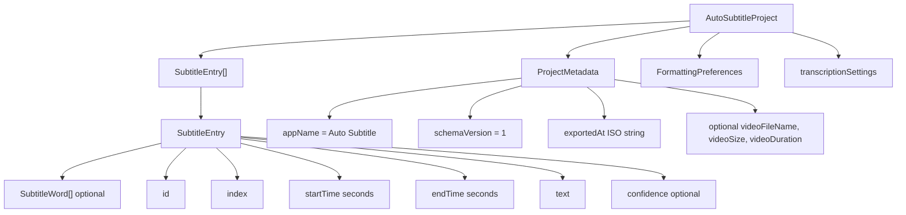

### `SubtitleEntry`

| Field | Type | Meaning |
| --- | --- | --- |
| `id` | `string` | Stable row identifier. Generated with `crypto.randomUUID()` when available. |
| `index` | `number` | One-based display/export order. Recomputed by sorting helpers. |
| `startTime` | `number` | Start time in seconds. |
| `endTime` | `number` | End time in seconds. |
| `text` | `string` | Display subtitle text. May contain line breaks. |
| `confidence` | `number \| undefined` | Optional confidence from future or imported sources. |
| `words` | `SubtitleWord[] \| undefined` | Optional word-level timing metadata. |

### `SubtitleWord`

| Field | Type | Meaning |
| --- | --- | --- |
| `text` | `string` | Word or token text. |
| `startTime` | `number` | Word start time in seconds. |
| `endTime` | `number` | Word end time in seconds. |
| `confidence` | `number \| undefined` | Optional confidence. |

### `AutoSubtitleProject`

| Field | Meaning |
| --- | --- |
| `metadata.appName` | Must be `Auto Subtitle`. |
| `metadata.schemaVersion` | Must be `1`. |
| `metadata.exportedAt` | ISO export time. |
| `metadata.videoFileName` | Optional hint used when restoring a project. |
| `metadata.videoSize` | Optional hint; the original video is not embedded. |
| `metadata.videoDuration` | Optional hint for duration comparison and validation. |
| `subtitles` | Sorted and renumbered subtitle list. |
| `formatting` | Formatting preferences active at export time. |
| `transcriptionSettings` | Optional copy of transcription settings. |

## Undo And Editing Model

`useUndoableSubtitles` stores:

```ts
{
  past: SubtitleEntry[][],
  present: SubtitleEntry[],
  future: SubtitleEntry[][]
}
```

Actions:

| Action | Behavior |
| --- | --- |
| `commit` | Sorts and renumbers new entries, pushes previous present into `past`, clears `future`, keeps the latest 80 past states. |
| `replace` | Sorts and renumbers entries and clears history. Used by transcription and imports. |
| `undo` | Moves the latest past state into present and pushes current present into future. |
| `redo` | Moves the first future state into present and pushes current present into past. |
| `clear` | Resets all history and entries. |

Editor operations call `commit`, while imports and transcription call `replace`.

## Subtitle Editor Behavior

The editor supports:

1. Search by subtitle text.
2. Previous and next search match navigation.
3. Filtering to rows with validation issues.
4. Auto-scroll to active subtitle.
5. Add before and add after.
6. Delete.
7. Duplicate.
8. Split.
9. Merge previous and merge next.
10. Move up and move down.
11. Play only the current subtitle range.
12. Seek to the subtitle start.
13. Inline timestamp editing.
14. Inline text editing.
15. Text reformatting on blur.

Timestamp input accepts:

1. `HH:MM:SS.mmm`
2. `HH:MM:SS,mmm`
3. `MM:SS.mmm`
4. `MM:SS,mmm`
5. Raw seconds, such as `62.345`

It rejects negative times, malformed strings, minutes greater than or equal to 60 in clock formats, and seconds greater than or equal to 60 in clock formats.

## Validation Rules

`validateSubtitles(entries, duration?)` emits warning or error issues.

| Code | Level | Condition |
| --- | --- | --- |
| `malformed-time` | Error | Start or end time is not finite. |
| `negative-time` | Error | Start or end time is negative. |
| `invalid-range` | Error | End time is not after start time. |
| `beyond-duration` | Warning | Start or end time is beyond known video duration. |
| `empty-text` | Warning | Text is empty or whitespace. |
| `overlap` | Error | Subtitle overlaps the previous or next entry. |

Exports omit entries with validation errors and omit empty text. Warnings do not block export.

## Import Details

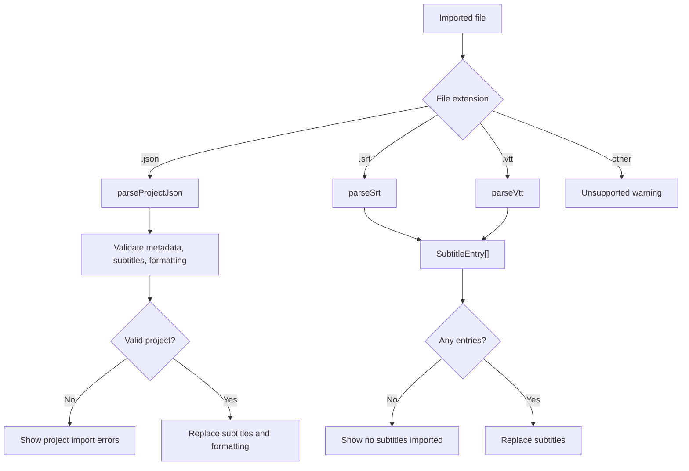

SRT parsing:

1. Normalizes newlines.
2. Splits blocks on blank lines.
3. Finds the first line containing `-->`.
4. Parses start and end times.
5. Joins remaining lines as text.
6. Skips malformed blocks with warnings.

VTT parsing:

1. Normalizes newlines and removes a UTF-8 BOM if present.
2. Warns if the file does not start with `WEBVTT`, but still parses leniently.
3. Removes the `WEBVTT` header.
4. Splits cue blocks on blank lines.
5. Skips `NOTE` blocks.
6. Parses cue timing and text.

Project JSON parsing:

1. Parses JSON.
2. Requires an object.
3. Requires `metadata.appName === 'Auto Subtitle'`.
4. Requires `metadata.schemaVersion === 1`.
5. Requires `subtitles` to be an array.
6. Normalizes each subtitle entry.
7. Normalizes formatting preferences with defaults for missing fields.
8. Validates subtitles and fails import if validation errors exist.

Project JSON does not contain the original video file. On restore/import, the UI tells the user to select the original video again and includes saved filename and duration hints when available.

## Export Details

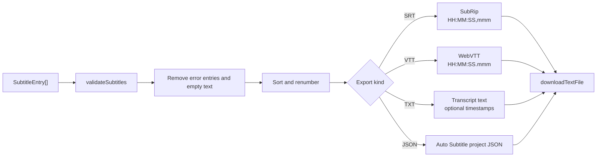

Export behavior:

| Export | File name | Contents |
| --- | --- | --- |
| SRT | `<video-base>.srt` | Numbered cues with comma milliseconds. |
| VTT | `<video-base>.vtt` | `WEBVTT` header and dot milliseconds. |
| TXT | `<video-base>.txt` | Plain transcript, one subtitle per line; optional timestamps. |
| JSON | `<video-base>.auto-subtitle.json` | Auto Subtitle project data with subtitles, formatting, metadata, and settings. |

`downloadTextFile` creates a `Blob`, creates an object URL, clicks a temporary anchor, then revokes the object URL.

## Autosave

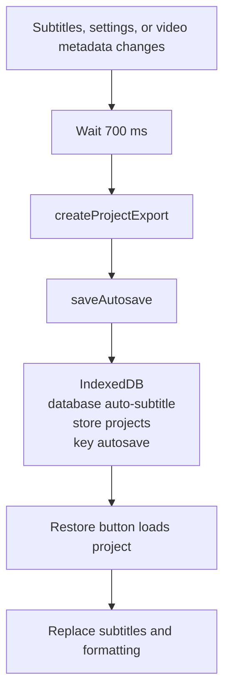

Autosave details:

| Item | Value |
| --- | --- |
| Database name | `auto-subtitle` |
| Version | `1` |
| Object store | `projects` |
| Key path | `key` |
| Autosave key | `autosave` |

Autosave stores project JSON data, not the original video. It includes video filename, size, and duration hints when known. Autosave can be restored or cleared from the toolbar.

## Theme Persistence

Theme preference is stored in localStorage under `auto-subtitle-theme`. Valid stored values are:

1. `light`
2. `dark`
3. `system`

When the preference is `system`, the app uses `window.matchMedia('(prefers-color-scheme: dark)')` to decide whether to set `document.documentElement.dataset.theme` to `dark` or `light`.

## Privacy And Data Movement

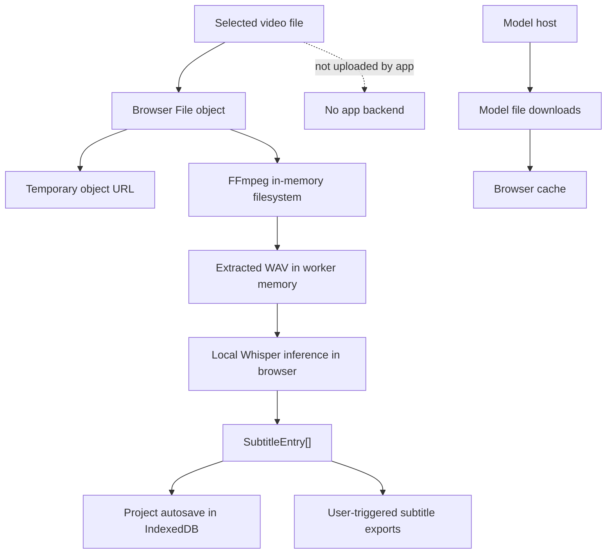

Important privacy facts:

1. The app has no application backend.
2. The selected video is not uploaded by the app.
3. The selected video is not stored in `public/`, the repo, or IndexedDB.
4. The original video is not included in project JSON exports.
5. Extracted audio is held in browser/worker memory.
6. Model files may be downloaded from the model host on first use and cached by the browser when supported.
7. Dev terminal progress is sent only to the local Vite server on `127.0.0.1`.
8. There is no analytics, tracking, authentication, Supabase, Firebase, or paid AI API integration.

## Error Handling

The app intentionally keeps errors visible:

| Failure point | Handling |
| --- | --- |
| Missing browser feature | Warning in transcription panel; WebAssembly or Worker absence disables transcription. |
| Bad video file | Validation errors in the drop zone. |
| Unreadable video duration | Error warning from video metadata handling. |
| FFmpeg load or exec failure | Worker error posts back to app; notice shows failure details. |
| Invalid WAV output | Worker throws `FFmpeg did not produce a valid WAV file.` |
| Unexpected WAV shape | Worker throws `Expected mono 16-bit PCM WAV audio.` |
| Silent extracted audio | Worker throws `The extracted audio appears to be empty or silent.` |
| Model download or pipeline failure | Worker posts error with stack details when available. |
| Word timestamp unsupported | Worker retries with segment timestamps. |
| User cancellation | Progress becomes `cancelled`; busy state clears. |
| Autosave load/save failure | Warning notice; app remains usable. |
| Import parse failure | Error notice with parse or validation details. |
| Export failure | Error notice with exception message. |

## Build And Development Configuration

`package.json` scripts:

| Script | Command | Purpose |
| --- | --- | --- |
| `dev` | `vite --host 127.0.0.1` | Start dev server. |
| `build` | `npm run typecheck && vite build` | Typecheck and produce production build. |
| `lint` | `oxlint` | Run lint checks. |
| `preview` | `vite preview --host 127.0.0.1` | Serve production build preview. |
| `test` | `vitest run` | Run tests. |
| `typecheck` | `tsc -b` | Typecheck TypeScript project references. |

Vite configuration:

1. Uses React plugin.
2. Adds `autoSubtitleTerminalPlugin`.
3. Runs dev server on `127.0.0.1:5173` with `strictPort`.
4. Runs preview on `127.0.0.1:4173` with `strictPort`.
5. Sets COOP and COEP headers for both dev and preview.
6. Uses ES module workers.
7. Excludes FFmpeg and Transformers packages from dependency optimization.
8. Configures Vitest with `jsdom` and globals.

## Testing Coverage

Current tests live in `src/tests/subtitle-utils.test.ts`.

They cover:

1. Timestamp parsing for clock and raw seconds formats.
2. Rejection of malformed timestamps.
3. SRT timestamp formatting.
4. VTT timestamp formatting.
5. SRT export.
6. VTT export.
7. SRT import with line breaks.
8. VTT cue import.
9. Sorting and renumbering.
10. Overlap validation.
11. Subtitle shifting without negative start times.
12. Split and merge behavior.
13. Long text formatting into readable lines.
14. Generated-caption line breaking that avoids unsafe phrase splits.
15. Generated-caption punctuation splitting.
16. Generated-caption reading-speed protection.
17. Generated-caption word-timestamp sync.
18. Generated-caption duplicate cleanup near chunk boundaries.
19. Live transcription preview replacement of pre-existing base subtitles.
20. Live transcription preview preservation of edited streamed rows.
21. Live transcription preview preservation of deleted streamed rows.
22. Valid project JSON round trip.
23. Malformed project rejection.

The tests focus on deterministic subtitle utilities and generated-caption post-processing. They do not currently run a full browser transcription because that would require FFmpeg.wasm, model downloads, browser worker execution, and substantial runtime.

## Keyboard Shortcuts

| Shortcut | Behavior |
| --- | --- |
| Space | Toggle play/pause when focus is not in an input, textarea, select, or contenteditable element. |
| Arrow Left | Seek backward 5 seconds. |
| Arrow Right | Seek forward 5 seconds, clamped to video duration when known. |
| Ctrl+Z or Cmd+Z | Undo subtitle edit. |
| Ctrl+Shift+Z, Cmd+Shift+Z, Ctrl+Y, or Cmd+Y | Redo subtitle edit. |
| Enter on a subtitle row | Seek to that subtitle's start time. |

## Known Limitations

1. Browser transcription can require significant memory and time for large videos.
2. FFmpeg.wasm writes the selected file into an in-memory filesystem before extraction, so video processing is not streaming.
3. The extracted audio buffer is held in browser memory.
4. Browser codec support varies by browser and source file.
5. WebGPU support varies by device and browser.
6. Model download size can be large on first run.
7. Word-level timestamps depend on the selected model export; unsupported models fall back to segment timestamps.
8. Chunk-boundary quality can vary. The worker uses overlap context, core clipping, and deterministic duplicate cleanup to reduce repeated captions, but manual review is still expected.
9. Generated subtitle timing is improved with word timestamp padding, reading-speed checks, and overlap cleanup, but it is not guaranteed perfect.
10. Project JSON does not embed the original video, so users must reselect the video after restoring a project.
11. Current automated tests do not execute the full FFmpeg plus Whisper pipeline.

## Extension Points

The app has a small transcription provider boundary. A future local engine could be added by matching the same concepts:

1. Accept a `File` and `TranscriptionSettings`.
2. Report `TranscriptionProgress`.
3. Resolve to `TranscriptionResult`.
4. Return `RawTranscriptionSegment[]`.
5. Let `formatTranscriptionSegments` convert results into `SubtitleEntry[]`.

Other natural extension points:

1. Additional Whisper model options with clearer size estimates.
2. A dtype control in the UI.
3. More spoken language options.
4. Streaming or media-pipeline-based audio extraction for lower memory use.
5. Waveform-based timing adjustment.
6. More import/export formats.
7. More advanced subtitle timing controls for reviewing generated captions.
8. Screenshot documentation in the README.

## End-To-End Summary

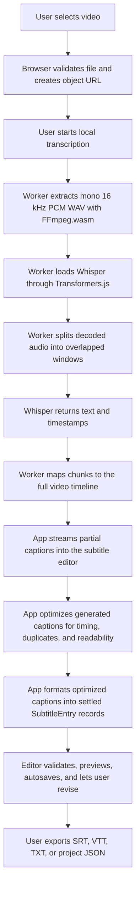

Auto Subtitle's central invariant is that everything becomes editable subtitle entries. The app's transcription system, importers, manual editor, preview overlay, autosave, and exporters all orbit that one data model.
